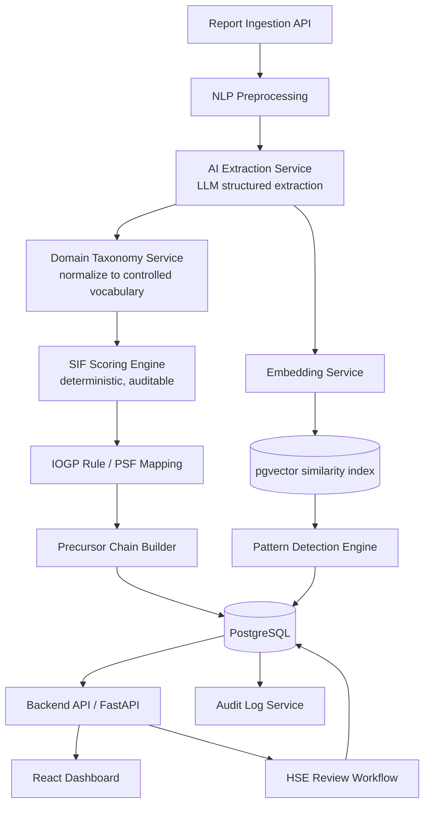
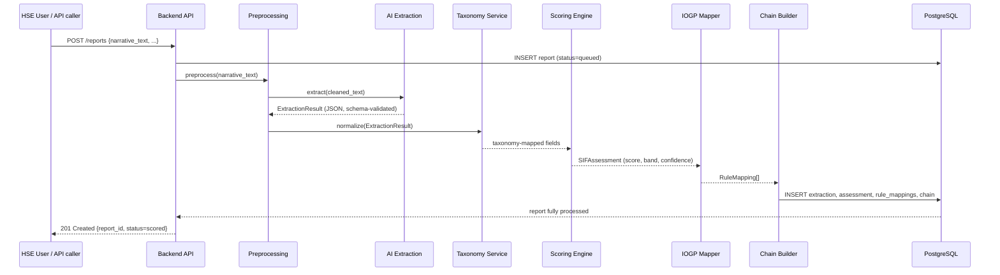
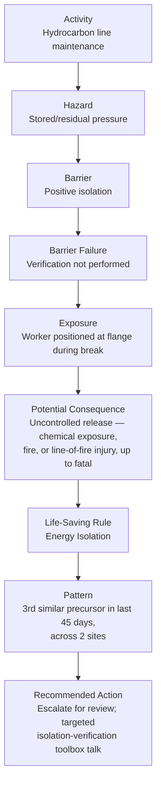
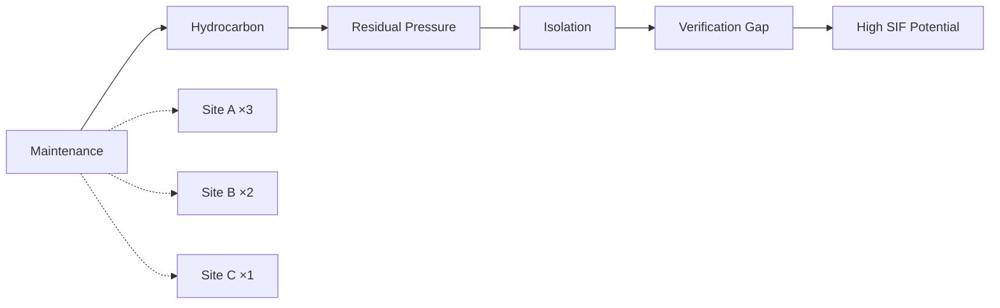
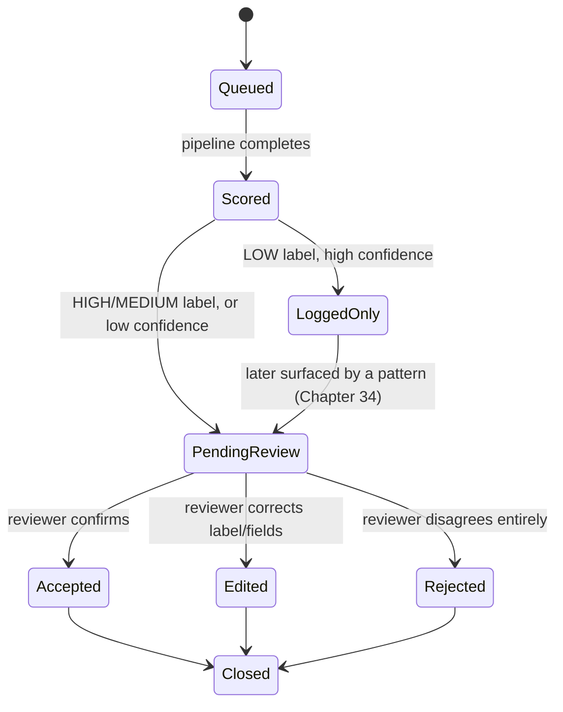
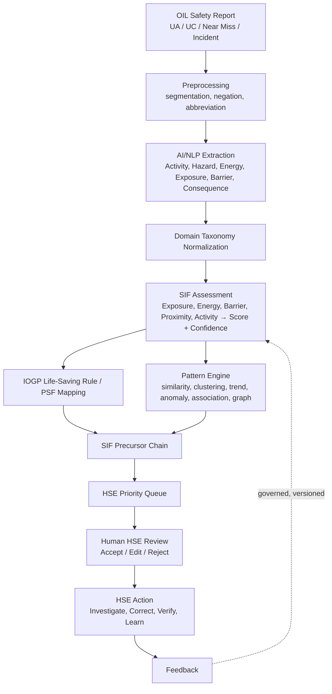

# NorthStar RiskRadar
## Prototype Technical Specification & Engineering Build Book

**SIH Problem Statement 26165** — AI/NLP Engine to Detect Serious Injury & Fatality (SIF) Precursors in Oil India Limited's Unsafe-Act / Unsafe-Condition and Near-Miss Reports
**Team:** NorthStar · **Target organization:** Oil India Limited (OIL)
**Document type:** Engineering source of truth (implementation-grade) — bridges the team's Research & Domain Immersion Handbook to source code
**Version:** 1.0 · **Status:** Draft for build kickoff

---

## Document Control & Source Discipline

This booklet is built strictly on two artifacts the team already owns:

1. **The RiskRadar Research & Domain Immersion Handbook** (91 pages, files `00`–`10`) — the domain/research source of truth. Every fact in this spec that comes from it is traceable to a chapter number.
2. **The team's own Implementation Roadmap and Master Prompt notes** — earlier engineering drafts, superseded where they conflict with the Handbook (one such conflict is called out explicitly in §7.2 — see the callout box there).

Three tiers of authority are used throughout, matching the Handbook's own honesty policy:

| Tag | Meaning | Example in this doc |
|---|---|---|
| **[VERIFIED]** | Independently confirmed from OIL's own materials, IOGP's official publications, peer-reviewed papers, or government sources, as cited in the Handbook | OIL's FY24–25 LTIFR of 0.071; the 9 IOGP Life-Saving Rules |
| **[INDUSTRY / RESEARCH-DERIVED]** | Established practice or published methodology (DEKRA, EEI, academic literature), not OIL-specific | The "reasonably likely if repeated" SIF-potential test; barrier taxonomy |
| **[NORTHSTAR PROPOSED]** | This team's own prototype design — a schema, a scoring formula, a UI screen — not an official OIL/IOGP/DEKRA artifact | The SIF scoring engine in §7.2; the database schema |
| **[SYNTHETIC / ILLUSTRATIVE]** | Example data written for teaching or demo purposes, never real OIL data | Every report narrative in this document |

**Relationship between documents:**

```
Research & Domain Immersion Handbook   (domain source of truth — WHY, and what is actually true)
              │
              ▼
This Technical Specification           (engineering source of truth — WHAT to build, HOW it fits together)
              │
              ▼
Source Code (built by an agentic IDE, e.g. Antigravity, following Part XVIII)
              │
              ▼
Tests                                  (verification that the code matches this spec)
```

An agentic coding IDE should treat this document as its primary context file, and load `CLAUDE.md` / `AGENTS.md` (Chapter 64) for compact, per-session pointers into it rather than re-reading the whole booklet every turn.

---

# PART I — TECHNICAL SPECIFICATION FOUNDATION

## Chapter 1 — Purpose of This Document

This booklet exists to remove every ambiguity between "we understand the problem" (the Handbook) and "here is the code" (the repository). It is written so that five different readers can each get what they need from it without reading the other four's sections end to end:

- A **senior/AI engineer** gets exact schemas, prompts, and scoring logic (Parts V–X).
- A **backend engineer** gets the database and API contracts (Parts III, XI).
- A **frontend engineer** gets the screen-by-screen UX spec (Part XII).
- An **HSE domain reviewer** gets the ontology, taxonomy, and safety-reasoning rules re-expressed in engineering terms, so they can verify nothing was lost in translation (Parts IV, VI–VIII).
- **An agentic coding IDE** gets a phased, testable build plan with an explicit Definition of Done per phase (Part XVIII), so it never has to guess what "done" means.

## Chapter 2 — Project Definition

**In one sentence [VERIFIED, Handbook Ch.1]:** Build an AI/NLP system that reads OIL's everyday safety reports and finds the small number of them that are quietly warning of a possible fatality — even when nobody got hurt.

**Target organization — Oil India Limited (OIL) [VERIFIED, Handbook Ch.2]:**
- Founded 1959 (Naharkatiya/Moran fields, Assam); wholly government-owned since 1981; operates under the Ministry of Petroleum and Natural Gas.
- Elevated to **Maharatna** status in August 2023 — the 13th Maharatna Central Public Sector Enterprise in India; government promoter stake ~56–57%; listed on NSE and BSE.
- A fully integrated upstream Exploration & Production company — India's oldest, second-largest public-sector E&P company after ONGC. Core businesses: crude oil and natural gas E&P, LPG production, crude/gas pipeline transport (including the 1,157 km Naharkatiya–Barauni trunk pipeline), and — since March 2021 — downstream refining via its subsidiary Numaligarh Refinery Limited (NRL, 3 MMTPA). Also expanding into solar, green hydrogen (with Himachal Pradesh Power Corporation Ltd.), CCUS, and compressed biogas.
- Field/registered HQ: **Duliajan, Assam**; corporate office: **Noida, Uttar Pradesh**. Core operations in Assam/Arunachal Pradesh, with exploration acreage in Rajasthan, Odisha, the Kerala–Konkan coast, and Andaman offshore, plus international participating interests (publicly reported: Russia, USA, Venezuela, Mozambique, Nigeria, Gabon, Bangladesh, Libya).
- **Why this matters for the taxonomy (Part VI):** OIL is not one facility. Reports could originate from a decades-old onshore field, a refinery, offshore/coastal exploration, or a renewables pilot — the hazard taxonomy must span all of these, not just "an oil field."

**OIL's confirmed HSE posture [VERIFIED, Handbook Ch.5]:**
- HSE described in OIL's FY2024–25 Annual Report as "a cornerstone of our corporate values."
- Confirmed practices: incident/near-miss reporting via kiosks and drop-boxes (specifically designed to include contractors), HAZOP and QRA for hazard assessment, JSA for significant jobs, an online work-permit system, mock emergency drills, and a named internal initiative called **KAVACH** (exact internal mechanics not public).
- **Best-ever LTIFR of 0.071** reported for FY2024–25 (cite the reporting period whenever quoting this — other public sources report 0.209 for a possibly different boundary/period; never present a single LTIFR figure as an eternal constant).
- OIL is presently in **Phase-II of an active HSE Transformation Plan** (Phase-I — perception survey, gap analysis, competency assessment — is complete), explicitly building "a robust HSE Management System." This is the single most important framing fact for the pitch: RiskRadar is a complement to a transformation OIL is already funding, not a cold pitch into an indifferent system.
- **Not publicly verified**, and must never be presented as fact: OIL's internal HSE org chart, exact UA/UC/near-miss volumes, or KAVACH's internal mechanics.

**Required capabilities [VERIFIED — from the PS text itself, Handbook Ch.1]:**

| # | Capability | In plain words |
|---|---|---|
| A | SIF classification | Read a UA/UC/near-miss/incident report's free text and predict SIF-potential vs. not |
| B | Life-Saving Rule mapping | If SIF-potential, tag it to the relevant IOGP Life-Saving Rule(s) |
| C | Pattern discovery | Find recurring activity + location + barrier-failure combinations across many reports and rank sites/activities by SIF-precursor density on a dashboard |

**Explicit exact deliverables:** ingest free-text reports → classify SIF-potential vs. non → tag to a Life-Saving Rule → surface recurring precursor patterns via a dashboard that ranks sites/activities by precursor density and auto-maps to Life-Saving Rules.

**Out of scope — RiskRadar must never be pitched or built as:**
- A predictor of the exact time, place, or identity of a future fatality.
- A replacement for OIL's HSSE reporting platform (RiskRadar is the intelligence layer *on top of* reports that already exist, not a new reporting app).
- A computer-vision PPE detector, a blockchain ledger, or an IoT hardware project.
- A compliance-certification tool for OISD/PESO/ISO standards (Part VIII, Chapter 29).
- An autonomous safety authority that "clears" a report as safe without human review.

## Chapter 3 — Product Requirements

| ID | Requirement | Rationale | Input | Output | Priority | Depends on |
|---|---|---|---|---|---|---|
| FR-001 | Report ingestion | Raw material for everything downstream | Report text + structured metadata | Stored `Report` row | Critical | DB schema |
| FR-002 | Narrative preprocessing | Keyword matching fails on negation/context [VERIFIED, Ch.22] | `narrative_text` | Cleaned, segmented text | Critical | FR-001 |
| FR-003 | AI/NLP extraction | Turn free text into structured evidence | Preprocessed text | `ExtractionResult` JSON | Critical | FR-002 |
| FR-004 | Hazard / energy / exposure / barrier classification | Core of the domain ontology (Ch.21) | `ExtractionResult` | Taxonomy-mapped fields | Critical | FR-003 |
| FR-005 | Barrier-failure-type classification | "Unverified" ≠ "failed" — the single most valuable output field [VERIFIED, Ch.11] | Extracted barrier mentions | One of 6 failure types | Critical | FR-004 |
| FR-006 | SIF-potential scoring | The PS's core deliverable A | Taxonomy-mapped fields | Score + High/Medium/Low band | Critical | FR-004, FR-005 |
| FR-007 | Confidence estimation | Never let a score look more certain than the evidence supports | Extraction completeness | 0–1 confidence, reported separately from the score | Critical | FR-003 |
| FR-008 | Evidence-span attachment | Explainability is non-negotiable in a safety-critical tool | Source text + extracted field | Char-offset evidence object | Critical | FR-003 |
| FR-009 | IOGP Life-Saving Rule mapping | PS deliverable B | Hazard/mechanism | 0, 1, or many of the 9 rules + confidence | Critical | FR-004 |
| FR-010 | Process Safety Fundamentals flag | Prevents conflating personal- and process-safety cases [VERIFIED, Ch.16] | Hazard type | Boolean `process_safety_relevant` | High | FR-004 |
| FR-011 | SIF Precursor Chain construction | The team's single most important demo asset (Ch.38) | All of the above | Ordered, evidence-linked node/edge structure | Critical | FR-004–FR-010 |
| FR-012 | Embedding + similarity search | "Has this happened before?" (dashboard screen 6) | Narrative text | Ranked list of similar past reports | High | FR-001 |
| FR-013 | Pattern / recurrence detection | PS deliverable C | Many reports over time | Recurring-pattern alerts, precursor density | High | FR-012 |
| FR-014 | HSE Priority Queue ranking | "What do I review today?" | Score, confidence, recency | Ranked report list | Critical | FR-006, FR-007 |
| FR-015 | 11-screen dashboard | Full UX surface (Ch.37) | All backend outputs | Rendered screens | Critical | FR-001–FR-014 |
| FR-016 | Human review workflow | Accountability is non-negotiable | Flagged report | Accept/Edit/Reject + reviewer identity | Critical | FR-014 |
| FR-017 | Feedback capture | Future model/rule improvement | Review decision | Stored correction record | High | FR-016 |
| FR-018 | Audit logging | Every score reproducible six months later | Every scored decision | Immutable audit record | Critical | All above |
| FR-019 | Model/prompt/taxonomy/rule versioning | "Why did RiskRadar flag this?" must have a real answer | Every pipeline run | Version tags on every output | Critical | FR-018 |
| FR-020 | Synthetic dataset generation | No access to real OIL report text [VERIFIED, Ch.28] | Hazard/barrier/activity taxonomy | Labeled synthetic reports incl. hard cases | Critical | Part VI |

## Chapter 4 — Non-Functional Requirements

| Category | Prototype (hackathon) requirement | Future production requirement |
|---|---|---|
| Performance | Single-report pipeline completes in a few seconds; dashboard queries return in well under a second on a demo-sized dataset | SLA-backed latency at OIL's real report volume, across all sites |
| Explainability | Every High/Medium score shows evidence text on click; no bare numbers | Same, plus a formal model-card and validation report for OIL's audit team |
| Auditability | Every score stores which model/prompt/taxonomy/rule version produced it | Immutable, tamper-evident audit trail; retention policy aligned to OIL's records-management requirements |
| Security | No real report content ever leaves the sandbox; demo runs on synthetic data only [VERIFIED, Ch.36] | On-prem or OIL-contracted private cloud; SSO; RBAC; encryption at rest/in transit; no confidential data to a public LLM endpoint without a data-processing agreement |
| Reliability | Demo-grade — a crashed AI call should degrade to "needs human review," never to silence | Retry/backoff, circuit breakers, graceful LLM-provider failover |
| Reproducibility | Same report + same model/prompt/taxonomy version ⇒ same score, deterministically re-derivable | Same, formally tested as part of change management |
| Maintainability | Clear module boundaries (extraction / taxonomy / scoring / patterns) so one layer can be fixed without touching the others [VERIFIED, Ch.25] | Same, plus CI/CD, code review, and a documented deprecation policy for taxonomy/rule versions |
| Deployment flexibility | Runs locally with Docker Compose | On-premise / private cloud / hybrid (Ch.36); never default to multi-tenant SaaS for confidential report content |

---

# PART II — SYSTEM ARCHITECTURE

## Chapter 5 — Complete System Architecture

The architecture is the engineering translation of the Handbook's central, non-negotiable principle [VERIFIED, Ch.25]:

> The LLM's job is narrow: extract evidence from text into a structured shape. Scoring is a separate, deterministic, auditable layer that operates on that structured evidence — never on raw model "vibes."



**Why each component exists, and why nothing extra was added:**

| Component | Why it exists | Why NOT split further |
|---|---|---|
| Preprocessing | Negation/context handling is the entire reason NLP beats keyword search [VERIFIED, Ch.22] | Runs in-process with extraction; a separate microservice would add latency for no benefit at prototype scale |
| AI Extraction Service | Isolates the one component allowed to call an LLM, so hallucination risk is contained to one auditable boundary | — |
| Domain Taxonomy Service | Converts free-form extracted terms ("residual pressure," "line still connected") into the fixed Ch.14 vocabulary — this is what stops a hallucinated hazard from silently producing a score [VERIFIED, Ch.25] | Kept as pure functions/lookup tables, not a network service, for prototype speed |
| SIF Scoring Engine | Deterministic and unit-testable, per FR-006 | Never merged into the extraction step — that would recreate the "just GPT" anti-pattern the Handbook explicitly warns against |
| Rule/PSF Mapping | PS deliverable B | Uses RAG over the actual IOGP rule text [VERIFIED, Ch.24] so tagging is grounded, not memorized |
| Precursor Chain Builder | The killer feature (Ch.38) — assembles the evidence-linked node/edge structure from everything upstream | — |
| Embedding + pgvector | Powers "similar reports" and clustering [VERIFIED, Ch.27] | A dedicated vector DB (Qdrant/Pinecone) is unnecessary at hackathon scale — `pgvector` keeps the stack to one database |
| Pattern Detection | PS deliverable C | Runs as a scheduled/background job, not inline with report scoring, since patterns are computed across many reports |
| Audit Log Service | FR-018/019 — six-months-later reproducibility | Implemented as an append-only table, not a separate service, for the prototype |

**Request flow for one report (the vertical slice, Chapter 62):**



## Chapter 6 — Recommended Technology Stack

Chosen for: rapid hackathon development, Python's AI ecosystem, a single database, and agentic-IDE friendliness (few moving parts to configure).

| Layer | Choice | Why | Alternative considered | Required for MVP? |
|---|---|---|---|---|
| Frontend | React + Tailwind CSS + Recharts | Fast to build dashboards; large ecosystem; Recharts covers every chart type Part XII needs | Vue (equally valid, less common in hackathon judging pools) | Yes |
| Backend API | Python + FastAPI | Native async, automatic OpenAPI docs (doubles as living API contract, Ch.37), first-class Pydantic validation for the JSON schemas in Part XIX | Node/Express (fine, but forces a second language boundary against the Python AI stack) | Yes |
| Database | PostgreSQL 15+ | One database for relational data, JSONB for evidence spans, and vectors via `pgvector` — avoids running three databases for a prototype | MongoDB (worse fit for the versioned, relational audit trail FR-018 needs) | Yes |
| Vector search | `pgvector` extension on the same Postgres instance | No extra infra; sufficient recall at demo scale | Qdrant/Pinecone/Weaviate (right call for real OIL-scale production, not for a hackathon) | Yes (MVP), swap-in optional for production |
| LLM provider | Abstracted behind a `LLMProvider` interface (Chapter 17); Anthropic Claude or an equivalent instruction-following model with reliable structured-output support | Confidence in JSON-schema adherence and low hallucination rate matters more than raw benchmark scores for this task | Open-weight local model (viable for the on-prem production story in Ch.36, not necessary for the demo) | Yes, swappable |
| Embeddings | A general-purpose sentence-embedding model (e.g. an `all-*` sentence-transformer or the embedding endpoint of the same LLM provider) | Needs to be good at short, technical safety-narrative sentences, not literary text | Fine-tuned domain embeddings (post-hackathon improvement, Ch.78) | Yes |
| NLP preprocessing | spaCy (segmentation, negation cues) + a small custom abbreviation/negation rule set | The Handbook's central example — "isolation completed" vs. "isolation not verified" — is a negation-detection problem before it is an LLM problem [VERIFIED, Ch.22] | Pure-LLM preprocessing (loses the fast, cheap, auditable first pass) | Yes |
| Graph/diagram viz | Rendered client-side from JSON (React component), not a graph database | The precursor chain is a bounded per-report DAG (≤15 nodes) — a graph DB is unjustified complexity at this scale | Neo4j (revisit only if the precursor graph needs organization-wide traversal in production) | No |
| Auth | JWT-based session auth for the prototype; designed to be replaced by OIL SSO in production (Ch.36) | Simplest thing that supports RBAC roles (reviewer vs. leadership) | OAuth2/OIDC against a real IdP (production requirement, not MVP) | Yes (simplified) |
| Testing | pytest (backend/AI), Vitest + React Testing Library (frontend) | Standard, agentic-IDE-friendly, fast | — | Yes |
| Containerization | Docker Compose (`api`, `frontend`, `postgres`) | One command to run the whole system locally | Kubernetes (production concern, Ch.59, not hackathon) | Yes |

## Chapter 7 — Repository Architecture

```text
riskradar/
├── frontend/
│   ├── src/
│   │   ├── screens/                  # one folder per Ch.37 dashboard screen
│   │   │   ├── ExecutiveOverview/
│   │   │   ├── PriorityQueue/
│   │   │   ├── ReportDetail/
│   │   │   ├── SIFExplanation/       # the Precursor Chain UI — Chapter 43
│   │   │   ├── RuleMapping/
│   │   │   ├── PrecursorPatterns/
│   │   │   ├── SiteComparison/
│   │   │   ├── ActivityAnalysis/
│   │   │   ├── BarrierFailures/
│   │   │   ├── Trends/
│   │   │   └── Investigation/
│   │   ├── components/               # shared: EvidenceHighlight, ConfidenceBadge, ChainNode
│   │   ├── api/                      # typed fetch wrappers matching Part XI's contracts
│   │   └── App.tsx
│   └── package.json
├── backend/
│   ├── app/
│   │   ├── main.py                   # FastAPI app, router registration
│   │   ├── api/                      # one router module per resource (reports, assessments, patterns, reviews...)
│   │   ├── preprocessing/
│   │   │   └── nlp_pipeline.py       # segmentation, negation, abbreviation handling — Chapter 14
│   │   ├── extraction/
│   │   │   ├── llm_client.py         # LLMProvider abstraction — Chapter 17
│   │   │   └── extractor.py          # calls prompts/, validates against schemas/
│   │   ├── taxonomy/
│   │   │   └── normalizer.py         # maps free terms -> taxonomy/*.yaml canonical values
│   │   ├── scoring/
│   │   │   └── sif_engine.py         # SIFScoringEngine — Chapter 26
│   │   ├── rules/
│   │   │   └── iogp_mapper.py        # RAG-grounded LSR/PSF mapping — Chapter 29
│   │   ├── chain/
│   │   │   └── chain_builder.py      # Precursor Chain assembly — Chapter 31
│   │   ├── patterns/
│   │   │   ├── embeddings.py
│   │   │   └── pattern_engine.py     # clustering, similarity, anomaly, trend, association, graph — Chapter 35
│   │   ├── models/                   # SQLAlchemy models mirroring Chapter 9's schema
│   │   ├── schemas/                  # Pydantic request/response + the Part XIX JSON schemas
│   │   └── audit/
│   │       └── logger.py
│   ├── prompts/                      # versioned prompt files — Chapter 68
│   │   ├── v1_extraction_system.md
│   │   ├── v1_extraction_task.md
│   │   └── v1_rule_mapping.md
│   ├── taxonomy/                     # seed taxonomy files — Chapter 69
│   │   ├── hazards.yaml
│   │   ├── activities.yaml
│   │   ├── energies.yaml
│   │   ├── barriers.yaml
│   │   ├── barrier_states.yaml
│   │   ├── lsr_mapping.yaml
│   │   └── psf_mapping.yaml
│   ├── data/                         # seed data files — Chapter 70
│   │   ├── synthetic_reports.json
│   │   ├── ground_truth.json
│   │   └── demo_cases.json
│   ├── migrations/                   # Alembic migrations, ordered per Chapter 67
│   ├── tests/
│   │   ├── unit/
│   │   ├── integration/
│   │   └── safety_critical/          # the 12 test cases from Chapter 50
│   └── requirements.txt
├── docker/
│   ├── docker-compose.yml
│   ├── Dockerfile.backend
│   └── Dockerfile.frontend
├── docs/                             # this file, plus CLAUDE.md/AGENTS.md/etc. — Chapter 64
├── scripts/
│   ├── seed_db.py
│   └── generate_synthetic_dataset.py
└── README.md
```

Every file under `backend/app/` maps 1:1 to a named component in Chapter 5's diagram — an agentic IDE should never need to guess which file a given responsibility belongs in.

---

# PART III — DATA ARCHITECTURE

## Chapter 8 — Domain Data Model

This is the direct engineering translation of the Handbook's ontology [VERIFIED, Ch.21]:

```text
Report
 ├── report_type          (UA / UC / Near Miss / Incident)
 ├── activity             (Ch.14/20 taxonomy)
 ├── location              (site/installation)
 ├── narrative_text
 └── 1:1──▶ Extraction
              ├── hazard[]              (1..N — Ch.14; multi-hazard reports are supported, never forced to one label)
              ├── energy_type[]
              ├── exposure               (present: bool, description, proximity)
              ├── barrier[]
              │      └── barrier_failure_type   (missing/failed/weak/bypassed/degraded/unverified — Ch.11)
              ├── potential_consequence (free text — not a fixed enum; real consequences vary too much [VERIFIED, Ch.21])
              └── evidence_span[]        (every field above links back to source text)
                     │
                     ▼
              1:1──▶ SIFAssessment
                       ├── score (raw, pre-band)
                       ├── sif_potential_label  (High / Medium / Low)
                       ├── confidence            (0-1, reported SEPARATELY from the score — Ch.26)
                       └── component_scores{}    (exposure, energy, barrier, proximity, activity — for explainability)
                              │
                              ▼
                       1:N──▶ RuleMapping
                                ├── life_saving_rule    (0, 1, or many of the 9 — Ch.15)
                                ├── process_safety_relevant (bool — Ch.16)
                                ├── confidence
                                └── evidence_span
                                       │
                                       ▼
                                1:1──▶ PrecursorChain (Ch.9, this doc)
                                       │
                                       ▼
                                1:N──▶ Pattern (via embeddings/clustering — Ch.10)
                                       │
                                       ▼
                                1:1──▶ HSEAction (recommended, advisory only)
                                       │
                                       ▼
                                1:N──▶ Review (accept/edit/reject, by a named HSE user)
```

**Relationship cardinalities:**
- `Report` 1—1 `Extraction` (one extraction per report; re-extraction on a new prompt version creates a new row, not an overwrite — see Chapter 10).
- `Extraction` 1—N `Hazard`, `Barrier`, `EvidenceSpan` (multi-hazard/multi-barrier reports are first-class, per the Handbook's explicit instruction never to force a single label [VERIFIED, Ch.15's "NorthStar Must Know" callout]).
- `SIFAssessment` 1—N `RuleMapping` (a report can touch more than one Life-Saving Rule — the SIMOPS example in Ch.9 touches both Safe Mechanical Lifting and Hot Work at once).
- `RuleMapping`/`Pattern` N—N via a join table `report_patterns` (one pattern spans many reports; one report can belong to more than one pattern).
- `Review` N—1 `Report` (a report can be reviewed more than once as new evidence or a new model version reprocesses it).

## Chapter 9 — Database Schema

```sql
-- Reports: the raw material. narrative_text is immutable once ingested.
CREATE TABLE reports (
    report_id          UUID PRIMARY KEY DEFAULT gen_random_uuid(),
    external_ref        TEXT UNIQUE,                 -- e.g. "NS-2026-000123" per Handbook Ch.29
    report_type         TEXT NOT NULL CHECK (report_type IN ('UA','UC','NEAR_MISS','INCIDENT')),
    report_date          DATE NOT NULL,
    site                TEXT NOT NULL,                -- controlled site list, not free text [VERIFIED, Ch.29]
    activity            TEXT NOT NULL,                -- FK to taxonomy/activities.yaml canonical value
    narrative_text       TEXT NOT NULL,
    actual_severity      TEXT CHECK (actual_severity IN ('NONE','FIRST_AID','MEDICAL_TREATMENT','LOST_TIME','FATALITY')),
    contractor_involved  BOOLEAN,
    source              TEXT NOT NULL DEFAULT 'SYNTHETIC' CHECK (source IN ('SYNTHETIC','OIL_AUTHORIZED')),
    ingested_at          TIMESTAMPTZ NOT NULL DEFAULT now(),
    created_at           TIMESTAMPTZ NOT NULL DEFAULT now()
);

-- Extractions: one row per (report, model/prompt/taxonomy version) — never overwritten, always appended.
CREATE TABLE extractions (
    extraction_id        UUID PRIMARY KEY DEFAULT gen_random_uuid(),
    report_id            UUID NOT NULL REFERENCES reports(report_id),
    model_version         TEXT NOT NULL,
    prompt_version        TEXT NOT NULL,
    taxonomy_version       TEXT NOT NULL,
    raw_llm_output        JSONB NOT NULL,               -- exact model response, for audit
    normalized_output      JSONB NOT NULL,               -- after taxonomy normalization
    created_at            TIMESTAMPTZ NOT NULL DEFAULT now()
);

CREATE TABLE hazards (
    hazard_id            UUID PRIMARY KEY DEFAULT gen_random_uuid(),
    extraction_id         UUID NOT NULL REFERENCES extractions(extraction_id),
    canonical_hazard       TEXT NOT NULL,                -- FK to taxonomy/hazards.yaml
    energy_type           TEXT,                         -- FK to taxonomy/energies.yaml
    energy_level          SMALLINT CHECK (energy_level BETWEEN 0 AND 3),
    evidence_span_id       UUID REFERENCES evidence_spans(evidence_span_id)
);

CREATE TABLE barriers (
    barrier_id            UUID PRIMARY KEY DEFAULT gen_random_uuid(),
    extraction_id          UUID NOT NULL REFERENCES extractions(extraction_id),
    canonical_barrier       TEXT NOT NULL,                -- FK to taxonomy/barriers.yaml
    barrier_status          TEXT NOT NULL CHECK (barrier_status IN
                            ('VERIFIED_INTACT','DEGRADED','UNVERIFIED','WEAK','MISSING','FAILED','BYPASSED')),
    evidence_span_id        UUID REFERENCES evidence_spans(evidence_span_id)
);

CREATE TABLE evidence_spans (
    evidence_span_id       UUID PRIMARY KEY DEFAULT gen_random_uuid(),
    report_id              UUID NOT NULL REFERENCES reports(report_id),
    field_name             TEXT NOT NULL,                -- e.g. "barrier.status", "exposure.present"
    source_sentence        TEXT NOT NULL,
    char_start             INTEGER,
    char_end               INTEGER,
    confidence             NUMERIC(3,2)
);

CREATE TABLE assessments (
    assessment_id          UUID PRIMARY KEY DEFAULT gen_random_uuid(),
    extraction_id          UUID NOT NULL REFERENCES extractions(extraction_id),
    scoring_version         TEXT NOT NULL,
    exposure_present        BOOLEAN NOT NULL,
    energy_level            SMALLINT NOT NULL CHECK (energy_level BETWEEN 0 AND 3),
    barrier_status_score     SMALLINT NOT NULL CHECK (barrier_status_score BETWEEN 0 AND 3),
    proximity               SMALLINT NOT NULL CHECK (proximity BETWEEN 0 AND 2),
    activity_criticality      SMALLINT NOT NULL CHECK (activity_criticality BETWEEN 0 AND 2),
    raw_score               NUMERIC(6,3) NOT NULL,
    sif_potential_label      TEXT NOT NULL CHECK (sif_potential_label IN ('HIGH','MEDIUM','LOW')),
    confidence              NUMERIC(3,2) NOT NULL,        -- kept separate from raw_score — Ch.26
    process_safety_relevant  BOOLEAN NOT NULL DEFAULT FALSE,
    created_at              TIMESTAMPTZ NOT NULL DEFAULT now()
);

CREATE TABLE rule_mappings (
    rule_mapping_id        UUID PRIMARY KEY DEFAULT gen_random_uuid(),
    assessment_id           UUID NOT NULL REFERENCES assessments(assessment_id),
    life_saving_rule         TEXT CHECK (life_saving_rule IN (
                              'BYPASSING_SAFETY_CONTROLS','CONFINED_SPACE','DRIVING','ENERGY_ISOLATION',
                              'HOT_WORK','LINE_OF_FIRE','SAFE_MECHANICAL_LIFTING','WORK_AUTHORISATION',
                              'WORKING_AT_HEIGHT')),      -- NULL when the report maps to PSF instead/only
    is_process_safety_fundamental BOOLEAN NOT NULL DEFAULT FALSE,
    confidence              NUMERIC(3,2) NOT NULL,
    evidence_span_id         UUID REFERENCES evidence_spans(evidence_span_id),
    rule_version             TEXT NOT NULL
);

CREATE TABLE patterns (
    pattern_id             UUID PRIMARY KEY DEFAULT gen_random_uuid(),
    pattern_type            TEXT NOT NULL CHECK (pattern_type IN
                             ('CLUSTER','SIMILARITY','ANOMALY','TREND','ASSOCIATION','GRAPH')),
    description             TEXT NOT NULL,
    hazard                  TEXT,
    activity                TEXT,
    site                    TEXT,
    window_days              SMALLINT,
    detected_at              TIMESTAMPTZ NOT NULL DEFAULT now()
);

CREATE TABLE report_patterns (                          -- N:N join
    report_id              UUID NOT NULL REFERENCES reports(report_id),
    pattern_id              UUID NOT NULL REFERENCES patterns(pattern_id),
    similarity_score         NUMERIC(4,3),
    PRIMARY KEY (report_id, pattern_id)
);

CREATE TABLE actions (
    action_id              UUID PRIMARY KEY DEFAULT gen_random_uuid(),
    report_id               UUID NOT NULL REFERENCES reports(report_id),
    action_type              TEXT NOT NULL,               -- e.g. 'ESCALATE_FOR_REVIEW','TARGETED_TOOLBOX_TALK','LOG_ONLY'
    recommended_by            TEXT NOT NULL DEFAULT 'RISKRADAR',
    status                  TEXT NOT NULL DEFAULT 'RECOMMENDED' CHECK (status IN ('RECOMMENDED','ACCEPTED','COMPLETED','REJECTED')),
    created_at               TIMESTAMPTZ NOT NULL DEFAULT now()
);

CREATE TABLE reviews (
    review_id              UUID PRIMARY KEY DEFAULT gen_random_uuid(),
    report_id               UUID NOT NULL REFERENCES reports(report_id),
    assessment_id            UUID NOT NULL REFERENCES assessments(assessment_id),
    reviewer_id              TEXT NOT NULL,               -- FK to an OIL SSO identity in production
    decision                TEXT NOT NULL CHECK (decision IN ('ACCEPT','EDIT','REJECT')),
    corrected_label           TEXT CHECK (corrected_label IN ('HIGH','MEDIUM','LOW')),
    reason                  TEXT,
    reviewed_at              TIMESTAMPTZ NOT NULL DEFAULT now()
);

CREATE TABLE model_versions (
    model_version           TEXT PRIMARY KEY,
    provider                TEXT NOT NULL,
    released_at              TIMESTAMPTZ NOT NULL,
    notes                   TEXT
);

CREATE TABLE taxonomy_versions (
    taxonomy_version         TEXT PRIMARY KEY,
    released_at              TIMESTAMPTZ NOT NULL,
    changelog                TEXT
);

CREATE TABLE rule_versions (
    rule_version             TEXT PRIMARY KEY,
    released_at              TIMESTAMPTZ NOT NULL,
    source                  TEXT NOT NULL DEFAULT 'IOGP Report 459 (2017-18 simplification, 9 rules)'
);

CREATE TABLE audit_logs (
    audit_id                UUID PRIMARY KEY DEFAULT gen_random_uuid(),
    report_id                UUID REFERENCES reports(report_id),
    actor                   TEXT NOT NULL,               -- 'SYSTEM' or a reviewer_id
    event_type               TEXT NOT NULL,               -- 'EXTRACTED','SCORED','REVIEWED','OVERRIDDEN', etc.
    payload                 JSONB NOT NULL,
    occurred_at               TIMESTAMPTZ NOT NULL DEFAULT now()
);

-- Vector index for similarity search (Chapter 32)
CREATE EXTENSION IF NOT EXISTS vector;
CREATE TABLE report_embeddings (
    report_id                UUID PRIMARY KEY REFERENCES reports(report_id),
    embedding                 vector(384),                 -- dimension matches the chosen sentence-embedding model
    embedding_model_version    TEXT NOT NULL
);
CREATE INDEX report_embeddings_ivfflat ON report_embeddings USING ivfflat (embedding vector_cosine_ops);

CREATE INDEX idx_reports_site_date ON reports (site, report_date);
CREATE INDEX idx_assessments_label ON assessments (sif_potential_label, confidence);
CREATE INDEX idx_rule_mappings_rule ON rule_mappings (life_saving_rule);
```

**Ground truth stays separate from AI predictions** [VERIFIED, Ch.29–30]: `ground_truth.json` (Chapter 70) holds hand-labeled `sif_potential_label` / `life_saving_rule` values used only for evaluation (Part XV) — these are never written into `assessments`/`rule_mappings`, which store only what the pipeline produced. A held-out evaluation job joins the two by `report_id` to compute precision/recall; production code never reads `ground_truth.json`.

## Chapter 10 — Data Provenance and Lineage

Every scored report answers, six months later, "why did RiskRadar flag this?" with a concrete chain, not "because the model said so" [VERIFIED, Ch.26 closing principle]:

```text
report_id  →  extraction_id (model_version, prompt_version, taxonomy_version)
           →  assessment_id (scoring_version)
           →  rule_mapping_id[] (rule_version)
           →  review_id[] (reviewer_id, decision, timestamp)
```

Re-running a report through a newer model/prompt/taxonomy version **creates a new `extractions` row**, never overwrites the old one — this is what lets the team compare "how did version 2 score this differently from version 1?" and is required before any claim of model improvement (Part XXVII of the roadmap notes / Chapter 27 here).

---

# PART IV — SYNTHETIC DATA & DATASET ENGINEERING

## Chapter 11 — Dataset Design

Fields, aligned 1:1 to the Handbook's own proposed schema [VERIFIED, Ch.29] — this is the **ground-truth label schema**, distinct from the pipeline's own predicted-output schema in Part XIX:

| Field | Type | Example |
|---|---|---|
| `report_id` | string | `NS-2026-000123` |
| `report_type` | enum | `Near Miss` / `UA` / `UC` / `Incident` |
| `date` | date | `2026-03-14` |
| `location` | string (controlled site list) | `Field Site 4` |
| `activity` | enum (Ch.14 taxonomy) | `Maintenance` |
| `narrative_text` | free text | the actual written report |
| `hazard` | enum | `Stored/pressurized energy` |
| `energy_type` | enum | `Hydrocarbon pressure` |
| `exposure_present` | boolean | `true` |
| `barrier` | enum | `Positive isolation` |
| `barrier_failure_type` | enum (Ch.11) | `Unverified` |
| `sif_potential_label` | enum | `High` / `Medium` / `Low` |
| `life_saving_rule` | array of enum (Ch.15) | `[Energy Isolation]` |
| `process_safety_relevant` | boolean | `true` |
| `actual_severity` | enum | `None` / `First Aid` / `Medical Treatment` / `Lost Time` / `Fatality` |
| `contractor_involved` | boolean | `true` |

Everything except `narrative_text` (and an optional free-text `corrective_action_notes` field) is a **controlled, enumerated value** — this is what makes the dataset usable both to train/evaluate a classifier and to power reliable dashboard filters and aggregations [VERIFIED, Ch.29].

## Chapter 12 — Synthetic Dataset Generation Strategy

Because OIL's actual UA/UC/near-miss/incident report text is not publicly available and must be treated as internal, confidential data [VERIFIED, Ch.28], the prototype is built and demonstrated on a domain-calibrated synthetic dataset. The honest framing the team should use verbatim with a judge:

> "Our production target is OIL's actual historical UA/UC, near-miss, and incident report text. That dataset is not publicly available to us, so our prototype is built and demonstrated on a domain-calibrated synthetic dataset, modeled on OIL's confirmed reporting categories, IOGP's Life-Saving Rule taxonomy, and the published SIF research this handbook cites. The architecture is designed so OIL's actual authenticated report data could be substituted in directly, without redesigning the pipeline." [VERIFIED, Ch.28, quoted directly]

**Generation rules [VERIFIED, Ch.30]:**
1. Every synthetic report must trace to a specific, named hazard/barrier/activity combination — never generated freely.
2. Write the way real field reports actually read: specific, slightly clipped, technical. ("Positive isolation was not verified with a pressure test before flange breaking commenced" — not "the worker was being unsafe.")
3. Deliberately include the hard cases (not just the obvious ones): hidden SIF, non-SIF despite actual injury, ambiguous/incomplete, multi-hazard, contradictory narratives.
4. Aim for realistic class imbalance: DEKRA's verified ~25%-of-recordables figure [VERIFIED, Ch.8] is a reasonable calibration anchor for what fraction of reports should plausibly carry real SIF potential — an artificially even 50/50 dataset would teach the wrong lesson and would also make the recall-priority evaluation in Part XV meaningless.

**Prototype vs. real-world validation — never blur this line [VERIFIED, Ch.30]:**

| | Prototype validation | Real-world validation |
|---|---|---|
| Data | Synthetic, hand-designed | OIL's actual historical, authenticated reports |
| Proves | The pipeline runs correctly end to end; logic behaves sensibly on designed hard cases | Whether the system performs on real operational language and real base rates |
| Does NOT prove | Real-world accuracy, real-world false-positive/false-negative rates | — |

**Suggested MVP scale:** 150–300 synthetic reports for the working prototype (enough for meaningful precision/recall numbers on held-out data — Part XV), stratified so hard cases (below) are deliberately over-represented relative to their natural rarity, with a documented split: 70% train / 15% validation / 15% test, site-aware (no site's reports split across train and test) to avoid leakage (Chapter 52).

## Chapter 13 — Seed Demo Dataset

18 records below are the team's **demo-critical seed set** — the small, carefully chosen collection the SIF Precursor Chain (Chapter 30) and dashboard should be built and rehearsed against first. Every narrative is either drawn directly from, or a direct variant of, the Handbook's own worked examples [SYNTHETIC/ILLUSTRATIVE, adapted from Ch.3, 9, 20, 26, 30, 38 — never real OIL data].

| ID | Difficulty category | Activity | Narrative (abridged) | Hazard / Energy | Exposure | Barrier → Failure | SIF label | Life-Saving Rule(s) |
|---|---|---|---|---|---|---|---|---|
| DEMO-01 | Hidden SIF (the flagship example) | Maintenance | "Work began after upstream valve closed. Positive isolation was not verified with a pressure test before flange breaking. Residual pressure was present. Worker near flange noticed a slight release and stepped back. No injury." | Stored/residual pressure | Worker at flange during break | Positive isolation → **Unverified** | **HIGH** | Energy Isolation |
| DEMO-02 | Obvious SIF | Lifting | "Worker briefly stood beneath a suspended load while repositioning rigging during a crane lift." | Suspended load / gravity | Worker directly beneath load | Exclusion-zone control → **Weak** | **HIGH** | Line of Fire, Safe Mechanical Lifting |
| DEMO-03 | Hidden SIF | Confined-space entry | "Entry made into vessel before atmospheric gas testing was completed; crew was behind schedule." | H₂S / toxic atmosphere | Entry without verified atmosphere | Gas testing → **Missing** | **HIGH** | Confined Space |
| DEMO-04 | Hidden SIF | Hot work | "Grinding performed near an open vent stack without first confirming the area was free of flammable vapor." | Fire/explosion, ignition source | Ignition source near vapor path | Vapor-free confirmation → **Missing** | **HIGH** | Hot Work |
| DEMO-05 | Obvious SIF | Work at height | "Access to an elevated platform made via a make-shift platform instead of approved access equipment; no fall-arrest harness observed." | Fall from height | Worker unprotected above ~1.8 m | Fall protection → **Missing** | **HIGH** | Working at Height |
| DEMO-06 | Multi-hazard / multi-rule | Maintenance | "Permit-to-work was signed, but the isolation points listed did not match what was physically isolated in the field." | Stored pressure + authorization gap | Worker relying on mismatched permit | Permit alignment → **Failed**; Isolation → **Unverified** | **HIGH** | Work Authorisation, Energy Isolation |
| DEMO-07 | Medium / behavioral | Driving | "Driver observed using a mobile phone briefly while transporting personnel between sites." | Vehicle movement | Driver + passengers | Safe-driving compliance → **Bypassed** | **MEDIUM** | Driving |
| DEMO-08 | Hidden SIF / process safety | Process monitoring | "Pressure alarm on a vessel was silenced pending a spare part, without a documented risk assessment for the interim period." | Process upset / loss of containment | No active alarm during interim period | Alarm/interlock → **Bypassed** | **HIGH** (process-safety relevant) | Bypassing Safety Controls |
| DEMO-09 | Multi-hazard (SIMOPS) | Shutdown — crane lift + hot work | "During a shutdown, a crane lift and hot-work grinding proceeded in adjoining areas without a documented SIMOPS review." | Suspended load + ignition source | Two crews, no coordination | SIMOPS review → **Missing** | **HIGH** | Safe Mechanical Lifting, Hot Work |
| DEMO-10 | Barrier degradation, no clean rule fit | Inspection | "A valve wheel felt loose and was reported after use, rather than before — a possible early sign of degradation on a safety-critical valve." | Mechanical / stored energy (latent) | None at time of report | Valve integrity → **Degraded** | **MEDIUM** | *(none — flag as "equipment integrity," don't force a rule)* |
| DEMO-11 | Non-SIF despite actual injury | Manual handling | "Worker experienced lower-back strain while manually lifting a component; first-aid treatment given." | Manual handling / ergonomic | Worker performing lift | *(no barrier failure identified)* | **LOW** | *(none)* |
| DEMO-12 | Contradictory narrative | Maintenance | "Isolation completed. [Later in the same report:] Isolation could not be confirmed by the second technician before work proceeded." | Stored pressure | Implied, not explicit | Isolation → **Unverified** (the later, more specific/operative statement governs — Ch.31 "last link in the chain" principle) | **HIGH** | Energy Isolation |
| DEMO-13 | Negation / negative evidence | Lifting | "No personnel were inside the exclusion zone at any point during the lift." | Suspended load | **Explicitly absent** | Exclusion zone → **Verified/intact** | **LOW** | *(none)* |
| DEMO-14 | Ambiguous / low confidence | Unspecified | "Safety issue observed near the process area. Reported for awareness." | Unclear | Unclear | Unclear | **Insufficient evidence → route to human review**, not a forced label | — |
| DEMO-15 | Hard negative (keyword trap) | Production | "Line pressure checked and confirmed within normal operating range per schedule; no anomalies noted." | Stored pressure (mentioned, but controlled) | No exposure — routine verification | Pressure-monitoring → **Verified/intact** | **LOW** | *(none)* |
| DEMO-16 | Barrier degradation | Confined-space prep | "Gas detector calibration was found overdue by 11 days during a pre-use check; unit was pulled from service before entry." | H₂S / toxic gas (latent) | None — caught before entry | Gas detection → **Degraded**, caught by pre-use check | **MEDIUM** | Confined Space |
| DEMO-17 | Obvious SIF, process safety | Drilling | "A kick was detected; well was not immediately shut in per procedure, drilling continued briefly to finish the stand." | Process upset / blowout potential | Crew present at rig floor | Well-control procedure → **Bypassed** (procedural deviation under time pressure) | **HIGH** (process-safety relevant) | *(Process Safety Fundamentals, not a personal-safety LSR)* |
| DEMO-18 | Obvious SIF | Lifting | "Rigging inspection was not documented prior to a scheduled lift; lift proceeded on schedule." | Mechanical / suspended load | Personnel in lift area | Rigging inspection → **Missing** | **HIGH** | Safe Mechanical Lifting |

**Fully worked JSON example (DEMO-01 — the flagship, used throughout Chapters 30, 43):**

```json
{
  "report_id": "DEMO-01",
  "report_type": "Near Miss",
  "date": "2026-03-14",
  "location": "Field Site 4",
  "activity": "Maintenance",
  "narrative_text": "During scheduled maintenance on a hydrocarbon transfer line, work began after the upstream valve was closed. Positive isolation was not verified with a pressure test before flange breaking commenced. Residual pressure was present in the line. The worker positioned near the flange noticed a slight release and immediately stepped back. Work was stopped and the line was re-isolated and verified before continuing. No injury occurred.",
  "hazard": ["Stored/pressurized energy"],
  "energy_type": "Hydrocarbon pressure",
  "exposure_present": true,
  "exposure_description": "Worker positioned near the flange at the moment of release",
  "barrier": ["Positive isolation"],
  "barrier_failure_type": "Unverified",
  "potential_consequence": "Uncontrolled release leading to chemical exposure, fire, or line-of-fire injury, up to fatal",
  "sif_potential_label": "High",
  "life_saving_rule": ["Energy Isolation"],
  "process_safety_relevant": true,
  "actual_severity": "None",
  "contractor_involved": false,
  "difficulty_category": "hidden_sif"
}
```

`synthetic_reports.json`, `ground_truth.json`, and `demo_cases.json` (Chapter 70) should be generated by expanding this pattern to the full MVP scale (Chapter 12), with `demo_cases.json` holding exactly these 18 records (plus any the team hand-picks for their specific pitch) and `ground_truth.json` holding the labels for the full 150–300-record set, kept structurally identical to this schema.

---

# PART V — NLP / AI ENGINE

## Chapter 14 — NLP Pipeline

**The problem this pipeline exists to solve** [VERIFIED, Ch.22, the single strongest concrete example in the whole project]:

> "Isolation completed." vs. "Isolation was not verified."

A keyword search for "isolation" treats both sentences identically. The first describes a barrier that is, on its face, intact; the second describes a barrier whose state is genuinely unknown — which, per DEKRA's "reasonably likely if repeated" test (Chapter 26), is exactly the situation with real SIF potential. Understanding the difference requires semantic understanding of negation and context, not keyword presence.

**Pipeline stages** (`backend/app/preprocessing/nlp_pipeline.py`):

| Stage | What it does | Why it matters here | Failure mode if skipped |
|---|---|---|---|
| Sentence segmentation | Splits narrative into sentences (spaCy) | The LLM extraction prompt (Chapter 16) reasons sentence-by-sentence for evidence-span attachment | Evidence spans can't be cleanly located in source text |
| Tokenization | Standard word/sub-word splitting | Feeds the baseline classifier (Chapter 15) | — |
| Spelling / abbreviation normalization | Expands site-specific shorthand (PTW, LOTO, ESD, BOP, HAZOP) against a controlled abbreviation dictionary | Field reports are "specific, slightly clipped, technical" [VERIFIED, Ch.30] | Extraction misses a barrier named only by its abbreviation |
| Negation detection | Flags negation cues ("not," "could not," "was assumed but," "failed to") and their scope | This is the *entire reason NLP beats keyword search* for this task [VERIFIED, Ch.22] | "Isolation completed" and "isolation not verified" get treated identically |
| Temporal-reference resolution | Distinguishes "was verified" (past, completed) from "assumed complete" (unconfirmed) from "later found" (retrospective correction) | Directly needed for the DEMO-12 contradiction case (Chapter 13) | Extraction can't tell which of two contradictory statements is more recent/operative |
| Duplicate-report detection | Near-duplicate narrative fingerprinting | Avoids inflating precursor-density counts (Chapter 27) with re-submitted reports | Pattern detection double-counts |
| Missing-field flagging | Marks which domain-model fields (Chapter 8) the narrative simply doesn't address | Feeds the confidence calculation directly (Chapter 26) | A vague report ("safety issue observed") gets forced into a confident-looking score instead of routed to human review |

## Chapter 15 — Baseline Model

Built *first*, before any hybrid pipeline work, to establish a benchmark [VERIFIED, Ch.40 build order, step 4: "a simple model first — don't start with the most complex possible architecture"].

| | Spec |
|---|---|
| Input | `narrative_text` (preprocessed) |
| Features | TF-IDF over the cleaned, tokenized narrative (fast baseline) — or, for a slightly stronger baseline within the same time budget, sentence embeddings from a pretrained BERT-family model, per the real precedent in PMC10998882 and the Transformer-LSTM paper (DOI 10.3390/buildings16091642) [VERIFIED, Ch.34] |
| Model | Logistic regression or linear SVM over TF-IDF (fastest to ship); or a single dense layer over BERT embeddings |
| Output | Binary `SIF-potential / Non-SIF-potential` only — **no** hazard/barrier/rule extraction at this stage |
| Purpose | A benchmark number to beat, and a smoke test that the whole ingestion → dataset → model loop works before any LLM cost/complexity is added |
| Evaluation | Same metrics as the full system (Chapter 51) — precision, recall, F1/F2, PR-AUC — computed on the same held-out split, so later improvement is measured against a real number |

## Chapter 16 — LLM Extraction Engine

**The LLM's job is narrow** [VERIFIED, Ch.25]: pull structured evidence out of free text. It never outputs a final SIF-potential verdict — that is the Scoring Engine's job (Chapter 26), operating on this structured output.

```json
{
  "activity": "string — one of the Chapter 19 taxonomy values, or null if not stated",
  "location_mentioned": "string | null",
  "hazards": [
    {"canonical_or_raw_term": "string", "evidence_span": "verbatim sentence", "confidence": 0.0}
  ],
  "energy": [
    {"type": "string", "level_description": "string", "evidence_span": "string"}
  ],
  "exposure": {
    "present": true,
    "description": "string | null",
    "proximity_description": "string | null",
    "evidence_span": "string | null"
  },
  "barriers": [
    {
      "name": "string — raw or canonical",
      "status_description": "string — the model's plain-language read of state, e.g. 'assumed complete, not verified'",
      "evidence_span": "string"
    }
  ],
  "potential_consequence": "string | null — free text, not an enum",
  "negations_detected": [
    {"span": "string", "negated_claim": "string"}
  ],
  "contradictions_detected": [
    {"span_a": "string", "span_b": "string", "which_governs": "string — the later/more specific statement, per Ch.31's 'last link in the chain' principle"}
  ],
  "uncertainties": [
    "string — anything the model could not confidently extract; NEVER silently filled in"
  ]
}
```

**Field-level rules:**
- `hazards`, `energy`, `barriers` are **arrays** — multi-hazard reports (DEMO-06, DEMO-09) are first-class, never forced to a single value [VERIFIED, Ch.15's "NorthStar Must Know" callout].
- Every populated field **must** carry an `evidence_span` that is a verbatim substring of `narrative_text`. A field with no evidence span is rejected by the schema validator and treated as absent, not guessed.
- `uncertainties` is not optional filler — it is the model's explicit "I don't know" channel, and a non-empty `uncertainties` array is one of the two direct inputs to the confidence score (Chapter 26), alongside missing-field flags from Chapter 14.
- The model must never populate `potential_consequence` or `sif_potential` — there is no `sif_potential` field in this schema at all, by design, because that judgment belongs to the deterministic Scoring Engine, not the LLM.

## Chapter 17 — LLM Prompt Architecture

**Never one giant prompt.** Three separate, versioned prompts, each with a narrow job:

| Prompt | Job | Grounded in |
|---|---|---|
| `v1_extraction_system.md` | Sets the model's role and hard constraints: extract only what the text supports; never invent a hazard; always cite `evidence_span`; use `uncertainties` rather than guessing | Ch.24's "hallucination" and Ch.25's hybrid-architecture principle |
| `v1_extraction_task.md` | The per-report extraction instruction, requesting the exact JSON schema of Chapter 16 | — |
| `v1_rule_mapping.md` | A **RAG-grounded** prompt that supplies the actual text of the 9 IOGP Life-Saving Rules (Chapter 29) as context, and asks the model to map extracted hazards/mechanisms to 0, 1, or many rule IDs with a confidence and a quoted trigger sentence | Ch.24: "RAG... grounds the model's tagging in the actual rule definitions rather than the model's possibly-imprecise memory of them" |

**`LLMProvider` abstraction** (`backend/app/extraction/llm_client.py`):

```python
class LLMProvider(Protocol):
    def complete_structured(
        self, system_prompt: str, task_prompt: str,
        schema: dict, temperature: float = 0.0
    ) -> dict: ...
```

- Temperature near 0 for extraction — this is a structured-extraction task, not a creative one; determinism aids reproducibility (FR-019).
- **Retry policy:** on a schema-validation failure, retry once with the validator's specific error appended to the prompt ("your `barriers[0]` object is missing `evidence_span`"); on a second failure, mark the report `extraction_failed` and route it to human review — never silently drop it or fabricate a passing response.
- **Malformed JSON handling:** parse defensively (`json.loads` in a try/except); a provider that occasionally wraps JSON in markdown fences is handled by a fence-stripping step before parsing, not by weakening the schema.
- **Provider swap:** because everything downstream consumes the JSON schema, not the raw model, the underlying LLM can be swapped (a different vendor, or an on-prem open-weight model for the production story in Chapter 58) without touching the taxonomy, scoring, or rule-mapping layers.

## Chapter 18 — Evidence Extraction

Every field in Chapter 16's schema that feeds a High/Medium score must resolve to a concrete `EvidenceSpan` row (Chapter 9's schema): `report_id`, `field_name`, `source_sentence`, optional `char_start`/`char_end`, `confidence`.

**Frontend behavior:** clicking any extracted field (in Report Detail, Chapter 41, or any Precursor Chain node, Chapter 43) highlights the exact source sentence in the original narrative, shown alongside it. **A field with no evidence span is never displayed as a confident finding** — the UI renders it as "not stated" rather than inventing a placeholder. This single rule is what makes the system's explainability claim (Chapter 73's judge-proofing) literally true rather than aspirational.

---

# PART VI — DOMAIN TAXONOMY

## Chapter 19 — Hazard Taxonomy

The full oil & gas hazard reference, taken directly from the Handbook's own verified table [VERIFIED, Ch.14], extended here with the extraction-keyword column an NLP system actually needs. This taxonomy is intentionally broader than "only the 9 Life-Saving Rules" — IOGP is explicit that the Rules are not exhaustive of every hazard [VERIFIED, Ch.15's "NorthStar Must Know"], so a report can carry real SIF potential without cleanly mapping to any single rule (DEMO-10, DEMO-17).

| Canonical hazard | Typical barriers | Typical precursor phrases (extraction aliases) | Likely Life-Saving Rule |
|---|---|---|---|
| Stored/pressurized energy | Isolation valves, pressure relief, verified de-pressurization | "isolation assumed," "residual pressure," "line still connected" | Energy Isolation |
| Electrical energy | LOTO, insulated tools, verified de-energization | "circuit not confirmed dead," "worked live" | Energy Isolation |
| Hydrocarbon release / loss of containment | Vessel/pipe integrity, gas detection, ESD | "gas smell reported," "sheen observed," "pressure drop noted" | *(Process Safety Fundamentals — Chapter 20)* |
| H₂S / toxic gas | Gas detection, forced ventilation, breathing apparatus | "gas alarm activated," "detector not calibrated," "entered without testing" | Confined Space (if enclosed) |
| Fire / explosion | Ignition-source control, vapor monitoring, fire suppression | "ignition source present," "hot work near vent" | Hot Work |
| Working at height | Fall-arrest harness, guardrails, secured anchor points | "no harness observed," "make-shift platform," "leaning ladder" | Working at Height |
| Dropped objects / suspended loads | Load securing, exclusion zones, tool tethering | "worker under load," "unsecured tool at height" | Line of Fire, Safe Mechanical Lifting |
| Line of fire | Positioning awareness, exclusion zones, barricading | "stood near swinging load," "between vehicle and wall" | Line of Fire |
| Confined space | Atmospheric testing, entry permit, standby person | "entered before gas test," "no attendant present" | Confined Space |
| Hot work | Fire watch, gas testing, hot-work permit | "grinding near open drain," "permit not renewed" | Hot Work |
| Vehicle movement / driving | Seatbelts, speed limits, journey management, fit-for-duty driving | "phone use while driving," "excessive speed noted" | Driving |
| Lifting operations | Rigging inspection, load charts, exclusion zones | "sling condition not checked," "lift plan not followed" | Safe Mechanical Lifting |
| Working-authorization gaps | Permit-to-work system, authorization sign-off | "work started before permit signed," "scope changed without re-authorization" | Work Authorisation |
| Bypassed safety controls | Change management/risk assessment before any bypass, time-limited bypass with compensating measures | "alarm silenced," "interlock jumpered," "bypass not logged" | Bypassing Safety Controls |
| Excavation | Permit, shoring, utility locating | "trench unshored," "dig without clearance" | *(Folded into Work Authorisation since the 2017–18 IOGP simplification — Chapter 20)* |
| Process upset / blowout | Well-control procedures, Blowout Preventer, process interlocks | "kick observed," "pressure anomaly not actioned" | *(Process Safety Fundamentals)* |

## Chapter 20 — Activity Taxonomy

Aligned to the operating lifecycle a barrel of oil or cubic meter of gas actually goes through [VERIFIED, Ch.3]:

```text
Exploration → Drilling → Well Completion → Production → Processing
  → Storage → Transportation → Maintenance → Decommissioning
```

Cross-cutting activities that occur at multiple lifecycle stages and get their own taxonomy entries because they carry distinct hazard profiles: **Lifting**, **Hot Work**, **Confined-Space Entry**, **Work at Height**, **Excavation**, **Inspection**, **Equipment Intervention**, **SIMOPS** (two or more of the above happening concurrently in the same area — flagged as its own tag, since combined activities can multiply risk in ways a single-activity classifier would miss [VERIFIED, Ch.7]).

Each activity carries a default **activity-criticality** weight (0–2) used directly by the Scoring Engine (Chapter 26) — e.g. Maintenance/Confined-Space-Entry/Hot-Work/Work-at-Height default to criticality 2 (statistically associated with higher fatal potential per Ch.26); routine Inspection defaults to 1; this is a `NorthStar-proposed` lookup table, tunable per Chapter 26's own note.

## Chapter 21 — Energy Taxonomy

| Energy type | Typical source in O&G operations |
|---|---|
| Stored/pressure | Hydrocarbon lines, vessels, hydraulic systems |
| Electrical | Circuits, transformers, switchgear |
| Mechanical | Rotating/reciprocating machinery, drill string |
| Gravitational / height | Suspended loads, elevated work |
| Chemical | H₂S and other toxic/reactive substances |
| Thermal | Hot surfaces, hot work ignition sources |

Each hazard in Chapter 19 maps to one or more energy types; the Scoring Engine's `energy_level` component (Chapter 26) is assessed per-report from whichever energy type the extraction identified as present, not from the hazard label alone.

## Chapter 22 — Exposure Model

Exposure is the DEKRA/EEI-verified center of the whole SIF concept [VERIFIED, Ch.7, Ch.26]: *was a person actually positioned where a hazard could reach and harm them?* A worker under a suspended load is exposed; a worker 50 meters away is not — same hazard, radically different SIF potential.

The extraction schema (Chapter 16) captures exposure as: `present` (boolean — was anyone in range at all), `description` (what they were doing), `proximity_description` (feeds the Scoring Engine's 0–2 proximity band: distant / nearby / direct contact). **Negation matters enormously here** — DEMO-13 ("No personnel were inside the exclusion zone") must resolve `exposure.present = false`, not merely "exposure is unmentioned."

## Chapter 23 — Barrier Model

**Six barrier types** [VERIFIED, Ch.11]:

| Type | What it is | Example |
|---|---|---|
| Physical / Engineering | Hardware that physically blocks or contains a hazard | Guard rail, pressure relief valve |
| Procedural | A documented process that, if followed, prevents harm | Permit to Work, LOTO procedure |
| Human | Depends on a person's competence, verification, or judgment | A worker correctly verifying isolation |
| Administrative | Organizational systems supporting safe behavior | Training, competency assessment, supervision |
| Preventive | Stops the hazard from becoming an incident at all | Gas detection triggering an automatic shutdown |
| Mitigative | Reduces the consequence after something has already gone wrong | Fire suppression, emergency shutdown valves |

**Six barrier-failure states** [VERIFIED, Ch.11] — this enum is the single most valuable extraction output field in the whole system:

| Status | Meaning | Distinct from |
|---|---|---|
| Missing | The barrier was never put in place | — |
| Failed | The barrier existed but broke or stopped functioning | *not* the same as unverified |
| Weak | The barrier exists but wasn't designed adequately for the hazard | — |
| Bypassed | Someone deliberately disabled or worked around it, often under time pressure | — |
| Degraded | Still technically exists but has lost effectiveness over time (corrosion, wear, drift) | — |
| **Unverified** | May or may not be working — nobody confirmed it before relying on it | **The single most common pattern in maintenance-related SIF precursors** [VERIFIED, Ch.11] |

> **Non-negotiable extraction rule** [VERIFIED, Ch.11's callout]: "Isolation completed" is not the same claim as "isolation verified." The first describes an *intended* state; the second a *confirmed* state. A report that only says isolation was "assumed complete" describes an **unknown** barrier state (`UNVERIFIED`), not a `FAILED` one — the AI extraction layer must never upgrade "unverified" to "failed," because that overstates what the evidence actually supports, and the Scoring Engine treats the two very differently (Chapter 26).

---

# PART VII — SIF ASSESSMENT ENGINE

## Chapter 24 — SIF Potential Concept

**Actual severity vs. potential severity** — the distinction the entire project turns on [VERIFIED, Ch.8]:

| | Actual severity | Potential severity |
|---|---|---|
| Definition | What really happened | What could have happened if circumstances had been slightly worse |
| Example | A worker trips, catches the handrail, no injury | Had the handrail not been there, the same trip could have been fatal |
| Measured by | Recorded injury classification | Deliberate judgment: "if this kept happening, could it eventually be fatal?" |

**DEKRA's formal definition, adopted directly with attribution** [VERIFIED, Ch.8, quoted]: *"An incident has SIF potential when a serious injury or fatality is reasonably likely to occur if the exposure continues uncontrolled."* The word "reasonably" is deliberate — a paper cut could theoretically cause a fatal infection, but that is not *reasonably likely*, so it is not SIF potential. The practical test, DEKRA's own "dice roll" framing: *if this exact situation repeated dozens or hundreds of times, would you reasonably expect it to eventually produce a serious injury?*

**Why this matters more than raw severity** [VERIFIED, Ch.8, DEKRA-sourced findings]:
- Fatality rates have stayed roughly flat for ~20 years across U.S. industry even as overall recordable-injury rates declined significantly — the causes of minor injuries and the causes of fatalities are often *not the same causes*.
- Only about **25% of OSHA-recordable injuries** carry realistic SIF exposure potential — most "recordable" incidents, while worth managing, are not where fatal risk concentrates.
- The reverse also holds (DEMO-11): the most common injury from manual lifting is soft-tissue strain, which is very unlikely to escalate to a fatality no matter how many times it recurs — an actual injury with genuinely low SIF potential.

RiskRadar must never rank purely by what happened. It ranks by DEKRA's potential-severity test — which is precisely the ranking a monthly, periodic manual review is structurally bad at producing [VERIFIED, Ch.9].

## Chapter 25 — SIF Scoring Engine

> **⚠ This entire scoring framework — every version discussed in this chapter — is NorthStar's own proposed prototype design.** It is not an official DEKRA, EEI, or IOGP formula. Present it to a judge exactly this way: *"our synthesis of the published methodologies in the Handbook, adapted for a hackathon prototype, intended to be tuned with real or synthetic data during development."* [VERIFIED, Ch.26]

### 25.1 — Reconciling two drafts of this formula (read this before implementing)

The team's own working documents contain **two different scoring formulas**, and this is worth resolving deliberately rather than letting an agentic IDE pick one at random:

| | Earlier roadmap/master-prompt draft | **Handbook Ch.26 (adopted here as authoritative)** |
|---|---|---|
| Components | 6: Energy, Exposure, Consequence, Barrier weakness, Activity criticality, **Evidence quality/confidence (Q)** | 5: Exposure(0/1), Energy(0–3), Barrier status(0–3), Proximity(0–2), Activity criticality(0–2) |
| Normalization | Each component 0–5, weights sum to 1.0 (`0.20E+0.20X+0.20C+0.20B+0.10A+0.10Q`) | Component-native ranges (see below); weights not numerically fixed in the source — explicitly "an illustrative starting point" |
| Confidence | Blended into the score itself as component `Q` | Reported **separately** from the score, driven by extraction completeness |
| Bands | 4-tier (`<2` low · `2–3.1` review · `3.2–4.1` high · `4.2–5` critical) | 3-tier (High / Medium / Low) |

**This spec adopts the Handbook's version as authoritative**, for two reasons: (1) it is the team's most recently produced, explicitly source-cited research artifact, and per this document's own source-discipline rule (Document Control, above) it takes precedence over earlier drafts; (2) keeping confidence **out of** the risk score is the methodologically sounder design — folding evidence-quality into the same number as risk means a genuinely high-risk report described in vague language would quietly score lower, which is exactly the "under-specified report gets a confident-looking number" failure mode the Handbook explicitly warns against (Chapter 26, Chapter 32). Confidence is tracked as an independent, equally-visible second number (Chapter 27's `SIF Potential: HIGH · Confidence: 92%` display), never averaged into the risk number itself.

If the team prefers the 6-factor 0–5-normalized shape for any reason (e.g. it demos better as a single 0–5 gauge), it can be recovered by treating the Handbook's formula as the authoritative *signal set* and re-normalizing for display — but the underlying signals, and the separation of confidence from score, should not change.

### 25.2 — The engine (`backend/app/scoring/sif_engine.py`)

```python
from dataclasses import dataclass
from enum import IntEnum

class BarrierStatusScore(IntEnum):
    VERIFIED_INTACT = 0
    DEGRADED = 1
    UNVERIFIED = 2
    FAILED_OR_BYPASSED = 3

class EnergyLevel(IntEnum):
    NONE = 0; LOW = 1; MODERATE = 2; HIGH = 3

class Proximity(IntEnum):
    DISTANT = 0; NEARBY = 1; DIRECT_CONTACT = 2

class ActivityCriticality(IntEnum):
    ROUTINE = 0; ELEVATED = 1; HIGH_CONSEQUENCE = 2   # lookup keyed to Chapter 20's activity taxonomy

@dataclass
class SIFScoringInput:
    exposure_present: bool
    energy_level: EnergyLevel
    barrier_status: BarrierStatusScore
    proximity: Proximity
    activity_criticality: ActivityCriticality

# NorthStar-proposed default weights — Ch.26 explicitly leaves these as an
# "illustrative starting point... tune with real or synthetic data." These are
# the concrete defaults this spec ships with; they are NOT calibrated against data.
DEFAULT_WEIGHTS = {
    "exposure": 2.0,     # binary gate: exposure=0 caps the whole score low (see below)
    "energy": 1.0,
    "barrier": 1.2,      # weighted slightly higher: barrier state is Ch.11's single most valuable signal
    "proximity": 1.0,
    "activity": 0.8,
}

def score_report(x: SIFScoringInput, weights: dict = DEFAULT_WEIGHTS) -> float:
    """
    Deterministic, unit-testable, auditable. No LLM call happens in this function —
    it is pure arithmetic over already-extracted, taxonomy-normalized fields, per
    the Ch.25 hybrid-architecture principle: the model extracts, this function decides.
    """
    if not x.exposure_present:
        # No credible exposure path to harm -> cannot be a SIF precursor, regardless
        # of how much energy or how bad the barrier state is (DEMO-15, the hard-negative case).
        return 0.0
    raw = (
        weights["exposure"] * 1
        + weights["energy"] * x.energy_level
        + weights["barrier"] * x.barrier_status
        + weights["proximity"] * x.proximity
        + weights["activity"] * x.activity_criticality
    )
    return raw   # banded into HIGH/MEDIUM/LOW by band_score() below, Chapter 26
```

### 25.3 — Signals, restated from the Handbook [VERIFIED, Ch.26]

| Signal | Question it answers | Source |
|---|---|---|
| Exposure | Was a person actually positioned where a hazard could reach them? | DEKRA, EEI |
| Energy | Was meaningful stored, electrical, mechanical, or other significant energy present? | EEI's SCL Model |
| Barrier / direct control | Was a relevant control present, verified, and effective? | EEI's SCL Model, Chapter 23 |
| Proximity | How close, in space and time, was the person to the point of potential release/failure? | — |
| Activity criticality | Is this an activity statistically associated with higher fatal potential? | Chapter 20 |

## Chapter 26 — SIF Decision Logic

```python
def band_score(raw_score: float, confidence: float) -> tuple[str, str]:
    """Returns (sif_potential_label, routing_decision)."""
    if confidence < 0.55:
        # Never force a confident-looking number out of an under-specified report.
        return ("INSUFFICIENT_EVIDENCE", "ROUTE_TO_HUMAN_REVIEW")   # DEMO-14

    if raw_score >= 5.5:
        label = "HIGH"
    elif raw_score >= 2.5:
        label = "MEDIUM"
    else:
        label = "LOW"

    if label in ("HIGH", "MEDIUM") and confidence < 0.70:
        # High/Medium + low confidence -> human review, never an automated final answer.
        return (label, "ROUTE_TO_HUMAN_REVIEW")
    if label == "HIGH":
        return (label, "PRIORITY_QUEUE")
    return (label, "LOG_ONLY")   # still searchable if a later pattern retroactively makes it relevant
```

**Escalation rules, verbatim from the source** [VERIFIED, Ch.26]:
- Reports scoring **High with high confidence** → straight to the HSE Priority Queue (Chapter 39).
- Reports scoring **High or Medium with low confidence** (ambiguous/incomplete text) → flagged for human review rather than auto-scored.
- Reports scoring **Low** → logged normally, but still searchable/available if a later pattern retroactively makes them relevant (Chapter 27's precursor-pattern engine can surface a previously-Low report if it turns out to be part of an emerging cluster).

This design deliberately biases toward **escalating uncertainty to a human rather than resolving it automatically** — directly consistent with the recall-over-precision principle validated by real published research (Chapter 51).

## Chapter 27 — Score Explanation

Every score is shown with its reasons, never as a bare number [VERIFIED, Ch.27]:

```text
SIF Potential: HIGH
Confidence: 92%

Reasons:
 • High-energy pressure source detected (energy_level = HIGH)
 • Worker positioned at a credible release point (exposure_present = true, proximity = direct_contact)
 • Isolation verification was not recorded (barrier_status = UNVERIFIED)
 • Potential uncontrolled hydrocarbon release identified
 • Activity: Maintenance (activity_criticality = HIGH_CONSEQUENCE)
```

versus a genuinely different case that must never be treated the same way:

```text
SIF Potential: HIGH  (raw score)
Confidence: 48%  →  ROUTED TO HUMAN REVIEW, not auto-flagged
```

Component scores (`exposure`, `energy`, `barrier`, `proximity`, `activity`) are always shown alongside the label — never only the final number — so a reviewer can see *which specific signal* drove the result and, per Chapter 25's design goal, fix that one layer if it's wrong without touching the others.

---

# PART VIII — IOGP / SAFETY FRAMEWORK MAPPING

## Chapter 28 — IOGP Life-Saving Rule Mapping

**Provenance** [VERIFIED, Ch.15, direct from IOGP's own official page and Report 459]: IOGP originally published Life-Saving Rules around 2010 (18 rules: 8 Core + 10 Supplemental), based on analysis of 1,484 fatal incidents (1991–2010) and 1,173 High Potential Events (2000–2010); IOGP's members concluded following the rules could have prevented roughly 70% of those fatalities. In 2017–18, after analyzing a further ten years of data, IOGP published **Report 459**, simplifying to **9 rules**, rewritten in first person for clarity. Over 2008–2017, IOGP states 376 people lost their lives in incidents that might have been prevented by following one of the Rules. Content was cross-checked against ARPEL, CONCAWE, NIOSH, and OSHA data. IOGP describes the Rules as "a final barrier" — not a replacement for a company's full management system, competent people, and site procedures. **Contractors carry out roughly 80% of the work in oil & gas** [VERIFIED, Ch.15], which is the explicit reason IOGP standardized on one industry-wide rule set rather than every operator having its own version.

> This spec reproduces IOGP's rule names and short descriptions as verified by the Handbook against IOGP's official page (`iogp.org/workstreams/safety/safety/life-savingrules/`) and Report 459. **Before external/production use, re-verify exact current wording directly against IOGP's official materials** — the names and mechanism below are stable and accurate as of this Handbook's research, but IOGP owns the authoritative text and trademark-protected iconography.

**The Nine Life-Saving Rules** [VERIFIED, Ch.15]:

| # | Rule | Core action | Typical report-text trigger |
|---|---|---|---|
| 1 | **Bypassing Safety Controls** | Obtain authorisation before overriding or disabling safety controls | "alarm silenced," "interlock jumpered," "bypass not logged" |
| 2 | **Confined Space** | Obtain authorisation before entering a confined space | "entered before gas test," "no attendant present" |
| 3 | **Driving** | Seatbelt always; obey speed limits; no phone/devices while driving; be fit, rested, alert; follow journey management | "phone use while driving," "excessive speed noted" |
| 4 | **Energy Isolation** | Verify isolation and zero energy before work begins | "isolation assumed," "positive verification not performed" |
| 5 | **Hot Work** | Control flammables and ignition sources | "grinding near open drain," "permit not renewed" |
| 6 | **Line of Fire** | Position yourself to avoid the line of fire (a majority of member-reported fatalities may have been prevented by this alone; IOGP's 2025 supporting materials name 10 specific Line-of-Fire hazard categories) | "stood near swinging load," "between vehicle and wall" |
| 7 | **Safe Mechanical Lifting** | Plan lifting operations and control the area | "sling condition not checked," "lift plan not followed" |
| 8 | **Work Authorisation** | Work only with a valid permit when required (this rule effectively absorbed the old, separate excavation rule — excavation was only ~2% of the 2008–2017 dataset, not enough on its own to justify a dedicated rule) | "work started before permit signed" |
| 9 | **Working at Height** | Protect against a fall (IOGP recommends **1.8 m / ~71 in** as a rule-of-thumb threshold, deferring to stricter local law where it differs) | "no harness observed," "make-shift platform" |

**Complementary IOGP concepts** [VERIFIED, Ch.15]: **Start Work Checks** — a practical, task-level pre-work verification ritual complementing the Rules. **Stop Work / Check and Reassess** — any worker who cannot confirm a Rule can be followed should stop the job and reassess, rather than continue and hope. A Rule violation remains a violation even if the specific case, on investigation, could not actually have led to a fatality — "nothing happened this time" does not close the loop.

**Mapping architecture:**

```text
Extracted evidence (Chapter 16)
        ↓
Hazard / mechanism (Chapter 19 taxonomy)
        ↓
RAG-grounded LLM call, supplied with the actual rule text above (Ch.29's prompt)
        ↓
0, 1, or many RuleMapping rows, each with: rule_id, confidence, evidence_span, rule_version
```

**Never force a single rule.** DEMO-06 and DEMO-09 (Chapter 13) each genuinely touch two rules at once; DEMO-10 genuinely touches none cleanly and should be tagged only as "equipment integrity" rather than shoehorned into the nearest-sounding rule [VERIFIED, Ch.14's Judge Tip: "RiskRadar should support multiple tags per report rather than forcing a single label, because real precursors often do span more than one rule"].

## Chapter 29 — Process Safety Fundamentals Mapping

**Personal safety vs. process safety** [VERIFIED, Ch.16] — a distinction judges specifically listen for, and a common, telling mistake to conflate:

| | Personal safety | Process safety |
|---|---|---|
| Definition | Preventing injury to an individual from a direct, acute hazard | Preventing loss of containment of a hazardous material, or loss of control of a hazardous process |
| Example | A worker falls from height | Hydrocarbon containment failure → vapor cloud → ignition |
| Typical scale | Usually the individual(s) directly involved | Can affect many people, including people not part of the original task |
| Governed by | The 9 Life-Saving Rules | IOGP's separately-published **Process Safety Fundamentals** |

A report about a valve found leaking, or an alarm silenced on a pressure vessel (DEMO-08), is a process-safety case — it may still map to a Life-Saving Rule (Bypassing Safety Controls, Energy Isolation) but deserves the **additional** `process_safety_relevant` flag (Chapter 8's schema), because these events can escalate to a scale a purely personal-safety framing would understate [VERIFIED, Ch.16]. The system carries this flag **alongside** the rule tag, never as a substitute for "mapped to a rule" being the only signal that matters. DEMO-17 (the drilling-kick example) is process-safety relevant and does **not** cleanly map to any of the 9 personal-safety rules — the mapping engine must be able to say so honestly rather than forcing a bad-fit LSR tag.

---

# PART IX — PRECURSOR CHAIN ENGINE

## Chapter 30 — Precursor Chain Construction

**This is the single feature most worth polishing for the demo** [VERIFIED, Ch.38, the Handbook's own words]: "it is the clearest, most concrete demonstration that RiskRadar is reasoning about safety, not just running a classifier." If hackathon time is short, build this — for a small, well-chosen set of the Chapter 13 seed reports, connected genuinely end-to-end from raw text to dashboard — before broadening anything else [VERIFIED, Ch.38's Judge Tip; Ch.40's build order].

Instead of showing a bare score:

```text
SIF Potential: 91%
```

the chain shows the full, evidence-linked reasoning [VERIFIED, Ch.38, the canonical worked example]:



**Every node links back to source evidence** (`EvidenceSpan`, Chapter 18) — a chain without evidence is not acceptable, per this document's own repeated architectural rule. Clicking any node reveals its value, a one-line explanation, the source sentence, and its confidence.

**Why this beats a bare classification score** [VERIFIED, Ch.38]:
- **Auditable** — a reviewer checks each link, not just an accept/reject on one number.
- **Teachable** — the chain doubles as a training artifact for a toolbox talk ("here's exactly what an isolation-verification failure looks like in report language").
- **Survives the hardest judge question** — "why did your model flag this?" has a specific, evidence-linked answer at every step.
- **Extends naturally into the precursor graph** (Chapter 31) — each chain is one path through a larger graph connecting hazards, barriers, activities, and locations, so the same data structure explains one report *and* powers site/activity-level pattern discovery.

**The four-layer reframing for the pitch** [VERIFIED, Ch.38, use this exact framing rather than "our AI classifies safety reports"]:

```text
Understand  →  Assess  →  Explain  →  Discover  →  HSE Action
```

**Note on node ordering:** the Handbook's own worked examples present this chain in two slightly different orders across chapters (Ch.20 places Exposure before Barrier; Ch.38 — the canonical "killer feature" chapter — places Barrier before Exposure). This spec resolves that by treating the underlying storage as a **graph** (Chapter 31), with the linear on-screen "chain" using Chapter 38's ordering, since that is the version explicitly identified as the demo-critical artifact. The graph representation is order-agnostic; only the UI rendering needs one canonical sequence.

## Chapter 31 — Precursor Graph Data Model

For a hackathon prototype, the graph is represented **relationally in PostgreSQL**, not in a dedicated graph database — the per-report chain is a bounded DAG of ≤15 nodes, and the organization-wide graph (Chapter 34's "graph analysis" technique) is a query over the same tables, not a separate storage engine.

```sql
CREATE TABLE chain_nodes (
    node_id          UUID PRIMARY KEY DEFAULT gen_random_uuid(),
    report_id         UUID NOT NULL REFERENCES reports(report_id),
    node_type         TEXT NOT NULL CHECK (node_type IN
                       ('ACTIVITY','HAZARD','BARRIER','BARRIER_FAILURE','EXPOSURE',
                        'CONSEQUENCE','SIF_POTENTIAL','LIFE_SAVING_RULE','PATTERN','ACTION')),
    value             TEXT NOT NULL,
    evidence_span_id   UUID REFERENCES evidence_spans(evidence_span_id),
    confidence        NUMERIC(3,2),
    sequence_order     SMALLINT NOT NULL   -- rendering order for the linear UI, Ch.38's canonical sequence
);

CREATE TABLE chain_edges (
    edge_id          UUID PRIMARY KEY DEFAULT gen_random_uuid(),
    from_node_id      UUID NOT NULL REFERENCES chain_nodes(node_id),
    to_node_id        UUID NOT NULL REFERENCES chain_nodes(node_id),
    relationship_type  TEXT NOT NULL   -- e.g. 'CAUSES', 'MITIGATED_BY', 'ESCALATES_TO'
);
```

The **organization-wide precursor graph** [VERIFIED, Ch.13, Ch.27] is a materialized query over `chain_nodes`/`chain_edges` across many reports — grouping by `(hazard, barrier, activity, site)` to show, in Bow-Tie terms, which preventive barriers are actually degrading in practice across the organization, not just in theory:



---

# PART X — SIMILARITY & PATTERN DETECTION

## Chapter 32 — Embedding Pipeline

- **Model:** a general-purpose sentence-embedding model over the (preprocessed) `narrative_text` — see the Chapter 6 stack recommendation. Fine-tuning on domain data is a post-hackathon improvement (Chapter 78), not an MVP requirement.
- **Storage:** `report_embeddings` (Chapter 9's schema), `pgvector` IVFFlat index, cosine similarity.
- **Metadata carried alongside each vector:** `report_id`, `site`, `activity`, `hazard[]`, `report_date` — needed so similarity search can be filtered/grouped without a second round-trip.
- **Retrieval:** top-K (default K=5) cosine-similarity neighbors, with a minimum similarity threshold (default 0.75, tunable) below which "no similar precursor found" is shown honestly rather than padding the list with weak matches.

## Chapter 33 — Similar Report Engine

```text
New report → embedding → pgvector similarity search → candidate reports
    → filter (date window, optionally same/different site)
    → rank by similarity score
    → display: "3 similar precursor reports detected in the last 45 days across 2 sites" [VERIFIED, Ch.27]
```

Each result returned to the frontend carries: `similarity_score`, matching concepts (shared hazard/barrier/activity tags), date, site, and precursor type — never just a bare "this resembles another report."

## Chapter 34 — Pattern Detection

Six techniques, all explicitly named in the Handbook [VERIFIED, Ch.27, Ch.34's "graph analysis" foundation]:

| Method | Input | Algorithm | Output | MVP priority |
|---|---|---|---|---|
| Clustering | Report embeddings | k-means or HDBSCAN over `report_embeddings` | Groups of semantically similar reports without pre-defined categories — surfaces an emerging pattern nobody knew to look for | High |
| Similarity search | One report's embedding | Chapter 33's pgvector kNN | "Has this happened before?" (dashboard screen 6) | Critical |
| Anomaly detection | Time-windowed counts per `(hazard, activity, site)` | Compare current rate to historical baseline (e.g. z-score over rolling window) | "Emerging pattern" alerts when a combination's rate suddenly rises | High |
| Trend analysis | Same counts, 30/60/90-day rolling windows | Simple time-windowed counting | Distinguishes a genuine trend from ordinary random variation | High |
| Association-rule mining | Structured fields (activity, site, shift, contractor status) | Apriori / FP-Growth over co-occurrence | Combinations that co-occur more than chance predicts (e.g. Maintenance + Contractor + Night Shift + Isolation Gap) | Medium |
| Graph analysis | `chain_nodes`/`chain_edges` across many reports | Graph query/aggregation (Chapter 31) | The organization-wide precursor graph — the technical foundation of the SIF Precursor Chain feature | High |

**Worked example** [VERIFIED, Ch.27]:

```text
Maintenance + Energy Isolation + Isolation-Verification-Failure
      appears in:
         Site A (3 times, last 45 days)
         Site B (2 times, last 30 days)
         Site C (1 time, last 10 days)
      ↓
Emerging Pattern flagged:
"Energy-isolation verification failures during maintenance have
 appeared at 3 sites in the last 45 days — a rate higher than this
 combination's historical baseline."
```

## Chapter 35 — Recurring Precursor Detection & Precursor Density

**Precursor density**, the exact term the PS itself uses [VERIFIED, Ch.9]: how concentrated SIF-precursor signals are for a site/activity/hazard, **relative to that entity's total report volume** — never raw count. A site with 5 reports where 3 show real SIF potential has far higher precursor density than a site with 500 reports where 3 show SIF potential, even though the raw count is identical. This is precisely what manual, periodic review is bad at noticing [VERIFIED, Ch.9], and precisely what the Site Comparison and Activity Analysis dashboard screens (Chapter 40) must rank by.

```python
def precursor_density(site: str, window_days: int = 90) -> float:
    high_or_medium_count = count_reports(site, window_days, label__in=["HIGH", "MEDIUM"])
    total_count = count_reports(site, window_days)
    return high_or_medium_count / total_count if total_count else 0.0
```

Never rank a site unfairly merely because it reports more observations — normalize by report volume, workforce/exposure where available, and time period, exactly as the Handbook insists [VERIFIED, Ch.9, Ch.35 of the roadmap notes].

---

# PART XI — BACKEND

## Chapter 36 — API Architecture

| Method | Path | Purpose | Auth |
|---|---|---|---|
| POST | `/reports` | Ingest a new report; triggers the full pipeline (Chapter 5) | API key / SSO |
| GET | `/reports` | List reports, filterable by site, activity, label, date range, review status | SSO |
| GET | `/reports/{id}` | Full report detail: narrative, extraction, evidence, assessment, rule mappings | SSO |
| GET | `/reports/{id}/chain` | The Precursor Chain (nodes + edges) for this report | SSO |
| GET | `/reports/{id}/similar` | Similar reports via embedding search | SSO |
| POST | `/reports/{id}/reprocess` | Re-run the pipeline against the current model/prompt/taxonomy version (creates a new `extractions` row, Chapter 10) | SSO, elevated role |
| GET | `/assessments/{id}` | A single SIF assessment with component scores | SSO |
| GET | `/rule-mappings?rule={rule}` | All reports mapped to a given Life-Saving Rule | SSO |
| GET | `/patterns` | Active/recent patterns (clusters, trends, anomalies) | SSO |
| GET | `/dashboard/priority-queue` | Ranked queue per Chapter 41 | SSO |
| GET | `/dashboard/executive-overview` | Screen 1 aggregate data | SSO |
| GET | `/dashboard/site-comparison` | Sites ranked by precursor density | SSO |
| GET | `/dashboard/activity-analysis` | Activities ranked by precursor density | SSO |
| GET | `/dashboard/barrier-failures` | Barrier-failure-type breakdown | SSO |
| GET | `/dashboard/trends` | Time-windowed pattern output | SSO |
| POST | `/reports/{id}/reviews` | Submit an HSE review decision (accept/edit/reject) | SSO, HSE reviewer role |
| GET | `/reports/{id}/actions` | Recommended/accepted HSE actions | SSO |
| POST | `/reports/{id}/actions/{action_id}/status` | Update an action's status | SSO |
| GET | `/audit/{report_id}` | Full audit trail for a report | SSO, elevated role |

**Pagination/filtering/errors** follow standard REST conventions: `?page=&page_size=` cursor or offset pagination on all list endpoints; `4xx` with a structured `{error_code, message, field}` body (`APIError` schema, Chapter 65); `429` on rate limiting for the AI-extraction-triggering `POST /reports` endpoint specifically, since that endpoint incurs LLM cost.

## Chapter 37 — API Contracts

**`POST /reports` — request:**
```json
{
  "external_ref": "NS-2026-000123",
  "report_type": "NEAR_MISS",
  "report_date": "2026-03-14",
  "site": "Field Site 4",
  "activity": "Maintenance",
  "narrative_text": "During scheduled maintenance...",
  "actual_severity": "NONE",
  "contractor_involved": false
}
```

**`POST /reports` — response (`201`):**
```json
{
  "report_id": "b3f1...-uuid",
  "status": "QUEUED",
  "links": {"self": "/reports/b3f1...", "chain": "/reports/b3f1.../chain"}
}
```

**`GET /reports/{id}` — response:**
```json
{
  "report_id": "b3f1...",
  "narrative_text": "...",
  "extraction": { "...": "Chapter 16 schema, taxonomy-normalized" },
  "assessment": {
    "sif_potential_label": "HIGH",
    "confidence": 0.92,
    "raw_score": 6.4,
    "component_scores": {"exposure": 1, "energy": 3, "barrier": 2, "proximity": 2, "activity": 2}
  },
  "rule_mappings": [{"life_saving_rule": "ENERGY_ISOLATION", "confidence": 0.91, "evidence_span": "..."}],
  "process_safety_relevant": true,
  "review_status": "PENDING"
}
```

**`GET /reports/{id}/chain` — response:** an ordered array of `chain_nodes` joined to their `evidence_span`, matching Chapter 31's schema — consumed directly by the Chapter 43 UI component.

**`POST /reports/{id}/reviews` — request:**
```json
{ "reviewer_id": "hse.officer.42", "decision": "EDIT", "corrected_label": "MEDIUM", "reason": "Isolation was in fact verified per follow-up interview; narrative was incomplete." }
```

## Chapter 38 — Background Processing

| Operation | Sync or async? | Why |
|---|---|---|
| Report ingestion (DB write, validation) | Sync | Needs to return a `report_id` immediately |
| AI extraction (LLM call) | **Async** (background job, `status: QUEUED → PROCESSING → SCORED/EXTRACTION_FAILED`) | LLM latency (seconds) shouldn't block the ingestion API response |
| Embedding generation | Async, chained after extraction | Same reasoning |
| Pattern detection (clustering, anomaly, trend) | Async, **scheduled** (not per-report) | Patterns are computed across many reports, not meaningfully per single ingestion |
| Dashboard aggregate queries | Sync, but backed by materialized/cached views refreshed on the pattern-detection schedule | Dashboard screens must feel instant even though the underlying pattern computation is periodic |

Job states: `queued → processing → completed | failed | retrying` (Chapter 17's retry policy governs `failed → retrying` for extraction specifically).

---

# PART XII — FRONTEND / UX

## Chapter 39 — UX Principles

**Every screen answers a decision question before it answers "what does the data look like?"** [VERIFIED, Ch.37's own design principle]. A dashboard full of pie charts with no clear point of view is a weak demo however polished it looks — this is explicitly named as a red-team failure mode (Chapter 76). Examples of the decision-question framing, used verbatim as the design brief for every screen below: "What needs HSE attention?" / "Why was this report flagged?" / "What evidence supports the decision?" / "Has this precursor occurred elsewhere?" / "Which barrier is repeatedly weakening?"

> **Build order matters** [VERIFIED, Ch.37's "Common Mistake" callout]: build screens 2–4 (the per-report priority queue and explanation) **before** screens 7–10 (the aggregate analytics views). The per-report experience is what a judge will actually click through during the demo.

## Chapter 40 — Dashboard Architecture — the 11 Screens

Reproduced and engineering-annotated directly from the Handbook's own screen-by-screen design [VERIFIED, Ch.37]:

| # | Screen | User | Decision question | What it shows | Backend endpoint |
|---|---|---|---|---|---|
| 1 | Executive Overview | Corporate HSE leadership | "How is SIF-precursor risk trending across the whole organization?" | Enterprise-wide SIF-potential trend, top-3 sites/activities by precursor density, headline emerging-pattern alerts | `/dashboard/executive-overview` |
| 2 | HSE Priority Queue | Site/corporate HSE reviewer | "Which reports need my attention today?" | Ranked list (not a flat table) by SIF score + confidence + recency | `/dashboard/priority-queue` |
| 3 | Report Detail | HSE reviewer | "Why was this report flagged?" | Full extracted evidence — hazard, activity, exposure, barrier, barrier failure, confidence — source text highlighted | `/reports/{id}` |
| 4 | SIF Explanation | HSE reviewer, judges | "Show your work." | The step-by-step, evidence-linked Precursor Chain (Chapter 30) | `/reports/{id}/chain` |
| 5 | Life-Saving Rule Mapping | HSE reviewer, site manager | "Which of the 9 rules is this connected to?" | Rule name, confidence, and the specific triggering text | `/rule-mappings` |
| 6 | Precursor Patterns | HSE reviewer, investigators | "Has this happened before?" | Similar past reports (embeddings, Chapter 33) with dates and locations | `/reports/{id}/similar` |
| 7 | Site Comparison | Site/corporate HSE leadership | "Which sites carry the most concentrated risk?" | Sites ranked by precursor density, **not raw count** | `/dashboard/site-comparison` |
| 8 | Activity Analysis | HSE leadership | "Which activities carry the most SIF potential?" | Activities ranked by precursor density | `/dashboard/activity-analysis` |
| 9 | Barrier Failures | HSE leadership, process safety | "What controls are actually failing in practice?" | Barrier-failure-type breakdown (Chapter 23) by hazard and site | `/dashboard/barrier-failures` |
| 10 | Trends / Emerging Patterns | HSE leadership | "Is something new starting to happen?" | Time-windowed pattern-detection output (Chapter 34) | `/dashboard/trends` |
| 11 | Investigation View | Investigators | "Give me a fast starting point." | Pre-populated evidence extract structured for handoff into a formal RCA process (5 Whys / Fishbone / FTA / ETA / ICAM / TapRooT® / Tripod Beta — Chapter 19 concepts) | `/reports/{id}` + `/reports/{id}/similar` |

The purpose of screen 11 is to **accelerate, not replace**, the human investigation [VERIFIED, Ch.37] — consistent with the whole system's advisory posture (Part XIII).

## Chapter 41 — Priority Queue

Ranking key: `(sif_potential_label DESC, confidence DESC, recency DESC)` — High-confidence-High comes first; within a label, more recent reports surface before older ones of equal score. **Alert-fatigue control:** the queue never surfaces `LOW`-labeled reports by default (they remain searchable, per Chapter 26's routing rule, but do not compete for reviewer attention), and `INSUFFICIENT_EVIDENCE` reports are shown in a visually distinct "needs more information" lane rather than mixed into the main ranked list, so a reviewer's default view is never diluted with reports the system is explicitly unsure about.

## Chapter 42 — Report Detail Page

Information hierarchy, top to bottom: **Original narrative** (with evidence highlighting available on demand) → **Extracted activity/hazards/energy/exposure/barriers/barrier status** → **Potential consequence** → **SIF score + confidence** (Chapter 27's explanation format) → **Evidence** → **IOGP mapping** (Chapter 28) → **Similar reports** (Chapter 33) → **Precursor Chain** (linked to the full-screen version, Chapter 43) → **Recommended HSE actions** → **Review status / review controls** (Accept / Edit / Reject, Chapter 44).

## Chapter 43 — Precursor Chain UI

The primary demo screen [VERIFIED, Ch.38]. Rendered as a vertical or left-to-right sequence of connected cards, one per `chain_nodes` row (Chapter 31), in `sequence_order`. **Every node is clickable**; clicking reveals the node's value, a one-line explanation, the linked evidence sentence (highlighted in a collapsible narrative panel), and its confidence. **Uncertain nodes** (confidence below a visible threshold, e.g. 0.6) render with a distinct visual treatment (dashed border / muted color) rather than looking as confident as a well-evidenced node — the UI must never let a low-confidence inference look identical to a well-evidenced one. **Multiple branches** (a report with two hazards, or a Life-Saving Rule node fanning out to two rules, as in DEMO-06/DEMO-09) render as a node splitting into parallel downstream paths, not as two separate, disconnected chains.

---

# PART XIII — HUMAN-IN-THE-LOOP

## Chapter 44 — HSE Review Workflow



**The human reviewer remains accountable, always** [VERIFIED, Ch.32's central safeguard]: RiskRadar's recommendation can be Accepted, Modified, or Rejected — never auto-finalized for `HIGH`/`MEDIUM` labels. Permissions: a **site-level reviewer** sees only their site's queue; a **corporate HSE leader** sees the enterprise-wide view (RBAC, Chapter 46). Every state transition writes an `audit_logs` row (Chapter 9).

## Chapter 45 — Feedback System

Captured on every review (`reviews` table, Chapter 9): the AI's original label, the reviewer's decision, any corrected label, a free-text reason, the reviewer's identity, and a timestamp. This is the raw material for the **governed** feedback loop in Chapter 48 — it is *never* used to silently retrain a live model; it feeds a versioned, tested, re-validated model-update cycle (Chapter 78, post-hackathon roadmap), exactly as the Handbook insists: "you don't simply let the model continuously learn from production decisions without controls."

---

# PART XIV — SECURITY & GOVERNANCE

## Chapter 46 — Security Architecture

| Control | Prototype | Production (Chapter 58) |
|---|---|---|
| Auth | JWT sessions | OIL SSO [VERIFIED, Ch.36] |
| Authorization | Two roles: site reviewer, corporate leadership | Full RBAC matching OIL's org structure |
| Encryption | TLS in transit; standard Postgres at rest | TLS + encryption at rest with OIL-managed keys |
| Secrets | `.env`, never committed | A managed secrets store |
| Input validation | Pydantic schema validation on every API boundary | Same, plus WAF/rate-limiting at the edge |
| Audit logging | `audit_logs` table, every scored decision and review | Same, plus tamper-evidence and a retention policy |
| Data minimization | Only synthetic data ever enters the demo system [VERIFIED, Ch.36] | Confidential report content stays within OIL-controlled infrastructure |

## Chapter 47 — AI Security

| Risk | Mitigation |
|---|---|
| Prompt injection (a narrative crafted to make the LLM ignore its extraction-only role) | The extraction prompt (Chapter 17) never grants the model any tool/action capability beyond returning JSON; schema validation rejects any output that isn't the expected shape, regardless of what the narrative asked for |
| Hallucination | Every field requires an `evidence_span`; a hallucinated hazard that doesn't map to the Chapter 19 taxonomy simply fails to produce a score rather than silently producing a wrong one [VERIFIED, Ch.25's Judge Tip, quoted almost verbatim] |
| Model overconfidence | Confidence is derived from extraction completeness (missing-field flags, `uncertainties` array — Chapter 14, 16), not self-reported by the LLM, precisely because a model's stated confidence is not the same thing as justified confidence [VERIFIED, Ch.24] |
| Unsafe generated recommendations | `Recommended HSE Action` is always advisory text reviewed by a human before any real-world action is taken (Chapter 44) |
| Sensitive report exposure | Prototype: synthetic data only, and if an external LLM API is used it is explicitly for demonstration purposes only, never real OIL content [VERIFIED, Ch.36's scripted answer] |

## Chapter 48 — AI Governance

Every high-impact decision is reproducible via the version chain in Chapter 10: `model_version`, `prompt_version`, `taxonomy_version`, `scoring_version`, `rule_version` are all stored per-extraction/assessment/rule-mapping, never overwritten. Six months later, the honest, complete answer to "why did RiskRadar flag this?" is: *"Model version X extracted these evidence spans; taxonomy version Y mapped them to these categories; scoring version Z generated this score; the HSE reviewer subsequently accepted/modified/rejected it"* — never "because the model said so."

---

# PART XV — TESTING & VALIDATION

## Chapter 49 — Testing Strategy

| Level | Scope |
|---|---|
| Unit | Extraction schema validation, taxonomy normalization, `score_report()`/`band_score()` (Chapter 25–26), rule-mapping lookup, pattern-detection functions |
| Integration | Full pipeline: `POST /reports` → extraction → taxonomy → scoring → rule mapping → chain → DB → `GET /reports/{id}` |
| API | Contract tests against Chapter 37's schemas |
| Frontend | Component tests for evidence highlighting, chain rendering, priority-queue ranking |
| Safety-critical | The 12 deliberately hard cases below, run against the **live** system, not mocked |

## Chapter 50 — Safety-Critical Test Cases

Directly instantiated from the Chapter 13 seed dataset, matching the Handbook's own required test categories [VERIFIED, Ch.30, Ch.42]:

| # | Case | Input (report) | Expected extraction | Expected label | Expected confidence | Expected rule | Pass/fail criterion |
|---|---|---|---|---|---|---|---|
| 1 | Obvious SIF precursor | DEMO-02 (worker under suspended load) | `exposure.present=true`, `proximity=direct_contact` | HIGH | High (>0.8) | Line of Fire, Safe Mechanical Lifting | Both rules present; not forced to one |
| 2 | Hidden SIF precursor | DEMO-01 (flange/isolation) | `barrier_failure_type=UNVERIFIED` (not `FAILED`) | HIGH | High | Energy Isolation | `UNVERIFIED` never upgraded to `FAILED` |
| 3 | Safe control (keyword trap) | DEMO-15 ("pressure checked and confirmed within normal range") | `barrier_status=VERIFIED_INTACT` | LOW | High | none | Presence of "pressure" alone does not raise the score |
| 4 | Ambiguous report | DEMO-14 ("safety issue observed") | `uncertainties` non-empty | `INSUFFICIENT_EVIDENCE` | Low (<0.55) | none | Routed to human review, not auto-labeled |
| 5 | Multi-hazard report | DEMO-09 (SIMOPS) | 2 hazards, 2 barrier failures | HIGH | High | Safe Mechanical Lifting **and** Hot Work | Both rules attached to one report |
| 6 | Contradiction | DEMO-12 ("completed" then "could not be confirmed") | The later, more specific statement governs | HIGH | Medium–High | Energy Isolation | Later statement, not the first, determines `barrier_status` |
| 7 | Negation | DEMO-13 ("No personnel were inside the exclusion zone") | `exposure.present=false` | LOW | High | none | Negation correctly flips exposure, not ignored |
| 8 | Barrier degradation | DEMO-16 (gas detector overdue, caught pre-use) | `barrier_status=DEGRADED`, caught before exposure | MEDIUM | Medium–High | Confined Space | Degraded ≠ Failed; exposure absent lowers score appropriately |
| 9 | Barrier bypass | DEMO-08 (alarm silenced) | `barrier_status=BYPASSED`, `process_safety_relevant=true` | HIGH | High | Bypassing Safety Controls | PSF flag set alongside the rule tag |
| 10 | Missing evidence | A report with `narrative_text` too short/generic to extract any field | All fields null/`uncertainties` | `INSUFFICIENT_EVIDENCE` | Low | none | System never invents a hazard to fill the gap |
| 11 | False-positive keyword trap | A report mentioning "confined space" only in a training-record context ("completed annual confined-space refresher training") | `exposure.present=false`, no entry event described | LOW | High | none | Topic mention ≠ hazard exposure |
| 12 | False-negative challenge | DEMO-11 (actual injury, low SIF potential) | `barrier_failure`=none identified | LOW | Medium–High | none | An actual injury does **not** automatically produce HIGH — actual severity ≠ potential severity (Chapter 24) |

## Chapter 51 — AI Evaluation

**Why accuracy alone is dangerous here** [VERIFIED, Ch.31, with the worked number]: if 1% of 100,000 reports are truly SIF-potential (roughly consistent with DEKRA's ~25%-of-recordables concentration finding, Chapter 24), a model that predicts "non-SIF" for every report scores 99% accuracy — and is completely useless, because it misses every genuinely dangerous report.

**Metrics that actually matter:**

| Metric | Formula / meaning | Why it matters here |
|---|---|---|
| Precision | TP / (TP + FP) | Of everything flagged, how much was genuinely relevant |
| Recall | TP / (TP + FN) | Of everything genuinely dangerous, how much did the system catch |
| F1 | Harmonic mean of precision and recall | Single balanced number |
| **F2** | Weights recall more heavily than precision | **The metric this exact problem should be tuned on** |
| Confusion matrix | TP / FP / TN / FN | Foundation for all of the above |
| PR-AUC | Precision/recall trade-off across all thresholds | The right summary metric for rare-event, imbalanced classification (preferred over ROC-AUC here, which can look artificially strong on heavily imbalanced data) |

**Why recall over precision — with a real citation, not just intuition** [VERIFIED, Ch.31, directly citing PMC10998882]: a 2024 peer-reviewed study on this exact PSIF-classification problem states that its safety subject-matter experts specifically guided the team to *"prioritize the maximization of recall over precision, through the use of the F2 metric for hyperparameter tuning."* In plain terms: missing a genuinely dangerous report (a false negative) is worse than sending an extra, ultimately-not-dangerous report for human review (a false positive) — independently validated by real published research on this exact task, not just this team's intuition. **This is the strongest, most specific answer available for a judge Q&A on evaluation methodology** — cite it by name.

Report class-specific metrics too, not only an overall number: per-hazard, per-barrier-failure-type, and separately on the hard-negative and ambiguous subsets of the test set (Chapter 13) — a system that performs well in aggregate but poorly on hard negatives is not actually ready.

## Chapter 52 — Dataset Splitting & Leakage Prevention

Site-aware split (no single site's reports appear in both train and test — a model that has "seen" Site A's writing style shouldn't be evaluated on more Site A reports), 70/15/15 train/validation/test, duplicate-narrative detection before splitting (Chapter 14's duplicate-report stage), and — once real OIL data is available (Chapter 79) — a temporal split (train on older reports, test on newer ones) to approximate how the system will actually be used going forward.

---

# PART XVI — OBSERVABILITY & OPERATIONS

## Chapter 53 — Logging

Structured (JSON) logs for: every API request (method, path, status, latency), every LLM call (prompt version, token count, latency, retry count — never the raw narrative text in plaintext logs if it could ever contain real OIL data), every extraction/scoring/rule-mapping/pattern-detection run, and every review action. Correlate all of the above by `report_id` so a single report's full processing history can be reconstructed from logs alone.

## Chapter 54 — Monitoring

| Signal | Why |
|---|---|
| API latency / error rate | Standard service health |
| LLM call failure rate | Extraction-failure spikes should page someone, not silently degrade |
| Score-distribution drift | If the fraction of reports scoring HIGH suddenly jumps or collapses, that's either a real signal or a broken pipeline — both worth knowing immediately |
| Confidence distribution | A creeping drop in average confidence suggests distribution shift (Chapter 32's named failure mode) between the training/synthetic data and what's now being ingested |
| Review disagreement rate | If reviewers are frequently rejecting/heavily editing HIGH-labeled reports, that's a leading indicator the scoring weights (Chapter 25) need recalibration |

## Chapter 55 — Error Handling

| Failure | Graceful behavior |
|---|---|
| LLM provider unavailable | Report stays `QUEUED`, retried with backoff; never falls back to a silent "no hazard found" |
| Malformed LLM output | Chapter 17's retry-once-then-human-review policy |
| Database unavailable | API returns `503`, ingestion request is not silently dropped (idempotent retry via `external_ref`) |
| Embedding/vector-search failure | Similarity features degrade gracefully (screen 6 shows "similarity search temporarily unavailable"); the SIF score and chain are unaffected, since they don't depend on embeddings |
| Incomplete report / invalid taxonomy value | Normalizer flags the value as `unmapped_raw_term`, surfaces it for taxonomy-maintainer review (Chapter 69), never silently drops or force-maps it to the nearest-sounding category |
| Conflicting evidence | Chapter 16's `contradictions_detected` array; scoring uses the later/more specific statement (Chapter 31's DEKRA-sourced "last link in the chain" principle) and the UI surfaces both statements, not just the resolved one |

**The one rule that governs every row above:** never silently invent safety information.

---

# PART XVII — DEPLOYMENT

## Chapter 56 — Local Development

```bash
git clone <repo> && cd riskradar
cp backend/.env.example backend/.env       # set LLM_API_KEY, DATABASE_URL
docker compose -f docker/docker-compose.yml up -d postgres
cd backend && pip install -r requirements.txt --break-system-packages
alembic upgrade head                        # run migrations, Chapter 67
python scripts/seed_db.py                   # loads the Chapter 13 seed dataset
uvicorn app.main:app --reload
# separate terminal:
cd frontend && npm install && npm run dev
pytest                                      # backend/tests, Chapter 49
```

## Chapter 57 — Docker / Containerization

`docker-compose.yml` services: `postgres` (with the `pgvector` extension image), `api` (FastAPI, depends on `postgres` healthcheck), `frontend` (Vite dev server or a built static bundle behind nginx for a closer-to-production demo). Environment variables injected per-service; no secrets baked into images.

## Chapter 58 — Prototype Deployment

Prioritize simplicity, reproducibility, low cost, and demo reliability over anything production-grade: a single Docker Compose stack on one VM (or a PaaS like Render/Railway for the demo URL), seeded with the Chapter 13 dataset, is sufficient and appropriate — do not over-engineer the hackathon deployment.

## Chapter 59 — Production Architecture (what would change)

| Dimension | Prototype | Production |
|---|---|---|
| Hosting | Single VM / PaaS | On-premise or OIL-contracted private cloud [VERIFIED, Ch.36] — never default multi-tenant SaaS for confidential report content |
| Auth | JWT | OIL SSO |
| Access control | Two roles | Full RBAC matching OIL's actual org structure |
| Integration | Manual seed / API ingestion | API integration with OIL's existing HSSE reporting platform, so new reports are processed as submitted [VERIFIED, Ch.36] |
| Data | Synthetic only | OIL's authenticated historical + live report data, under a formal data-processing agreement |
| Scale | Demo-sized dataset | OIL's real report volume across all sites, onshore and offshore, E&P and refining |
| Model hosting | Any capable LLM API | An approved, contracted model host with a data-processing agreement, or an on-prem/open-weight model, matching the confidentiality requirement above |
| Observability | Basic logs | Full Part XVI, plus formal SLAs |
| Governance | Chapter 48's version chain | Same, plus a change-management process for taxonomy/rule/model updates (Chapter 78) |

The hackathon prototype does **not** claim to already satisfy any row in the right-hand column — the honest framing throughout this document, and the framing the team should use with judges, is that the architecture is *designed to extend* into production, not that it already is production.

---

# PART XVIII — AGENTIC IDE IMPLEMENTATION PLAN

## Chapter 60 — Build Strategy

**Do not attempt to generate the entire system in one uncontrolled step.** The Handbook's own build order [VERIFIED, Ch.40] is the narrative backbone; this chapter expands it into a phase-by-phase plan with an explicit Definition of Done per phase, so an agentic IDE (e.g. Antigravity) — or a human team — always knows exactly what "done" means before moving on.

```text
Handbook Ch.40 (narrative)         This spec's phases (engineering)
────────────────────────────       ──────────────────────────────
1. Research                         (already complete — this document)
2. Domain model                     Phase 0-1
3. Synthetic dataset                Phase 2
4. Baseline classifier              Phase 3
5. AI extraction + hybrid scoring   Phase 4-7
6. Dashboard                        Phase 8-9 (screens 2-4 before 7-10, per Ch.37)
7. Integration                      Phase 10
8. Testing                          Phase 11
9. Demo script                      Phase 12
10. Pitch                           (outside this document's scope — Part XX)
```

## Chapter 61 — Phase-by-Phase Build Plan

| Phase | Objective | Files created | Key tasks | Definition of Done |
|---|---|---|---|---|
| **0** | Project init | `docker/`, `README.md`, `.env.example`, repo skeleton (Chapter 7) | Scaffold the directory tree; get Postgres + `pgvector` running | `docker compose up` starts an empty, healthy stack |
| **1** | Domain ontology + taxonomy | `backend/taxonomy/*.yaml` (Chapter 69) | Encode Chapter 19–23's tables as YAML; lock the domain model (Chapter 8) — every other member builds against this | A hazard/activity/barrier lookup returns the exact Chapter 19 table programmatically |
| **2** | Database + synthetic dataset | `backend/migrations/`, `backend/data/*.json` (Chapter 13, 70) | Run Chapter 9's DDL via Alembic; generate the 18-record seed set + expand to 150–300 for MVP scale (Chapter 12) | `seed_db.py` loads the full seed set without constraint violations |
| **3** | Baseline classifier | `backend/app/baseline/` | TF-IDF/BERT binary classifier (Chapter 15); compute its precision/recall/F1/F2/PR-AUC on the held-out split | A benchmark number exists and is recorded before any LLM work begins |
| **4** | AI extraction pipeline | `backend/app/extraction/`, `backend/prompts/v1_extraction_*.md` | Implement `LLMProvider`, the Chapter 16 schema, schema validation, retry policy (Chapter 17) | Running DEMO-01 through the extractor returns a schema-valid `ExtractionResult` with every field evidence-linked |
| **5** | Taxonomy normalization | `backend/app/taxonomy/normalizer.py` | Map raw extracted terms to Phase 1's canonical vocabulary | A hallucinated/unmapped term is flagged `unmapped_raw_term`, never silently mapped |
| **6** | SIF scoring engine | `backend/app/scoring/sif_engine.py` | Implement Chapter 25's `score_report`/`band_score`; unit tests for all 18 seed records | Every DEMO record (Chapter 13) produces the expected label in Chapter 50's test table |
| **7** | Evidence + IOGP/PSF mapping | `backend/app/rules/iogp_mapper.py`, `backend/prompts/v1_rule_mapping.md` | RAG-grounded mapping over the 9 rules (Chapter 28) + PSF flag (Chapter 29) | DEMO-06/DEMO-09 correctly return 2 rules each; DEMO-10/DEMO-17 correctly return 0 LSRs without forcing one |
| **8** | Backend API | `backend/app/api/*` | All endpoints in Chapter 36; contract tests against Chapter 37's examples | `POST /reports` → `GET /reports/{id}` round-trips a fully scored DEMO-01 |
| **9** | SIF Precursor Chain + dashboard screens 2–4 | `backend/app/chain/chain_builder.py`, `frontend/src/screens/{PriorityQueue,ReportDetail,SIFExplanation}` | Build the killer feature first, per Chapter 37's explicit build-order warning | A judge can click Priority Queue → Report Detail → SIF Explanation for DEMO-01 and see the exact chain in Chapter 30 |
| **10** | Similarity, patterns, remaining screens | `backend/app/patterns/*`, remaining `frontend/src/screens/*` | Chapter 32–35, dashboard screens 1, 5–11 | Screen 6 correctly reports "3rd similar precursor..." for the DEMO-01-family reports |
| **11** | Human review + testing | `frontend` review controls, `backend/tests/safety_critical/` | Chapter 44's workflow; run all 12 Chapter 50 test cases against the **live** system | All 12 safety-critical cases pass; review Accept/Edit/Reject round-trips into `reviews` and `audit_logs` |
| **12** | Security/governance polish + demo hardening | Audit endpoints, version tables | Chapter 46–48's controls; rehearse the demo script (Chapter 62) | A version chain can answer "why was this flagged?" for any seed report without looking at code |

## Chapter 62 — Vertical Slice First

Implement this **before** broadening to the full 11 screens or the full pattern-detection suite [VERIFIED, Ch.38's Judge Tip, Ch.40's "what to build first if time is short"]:

```text
One synthetic report (DEMO-01)
   → preprocessing → AI extraction → taxonomy → SIF scoring
   → IOGP mapping → evidence → SIF Precursor Chain → dashboard (screens 2-4)
```

**Why:** "A narrow, deep, honest demo beats a broad, shallow one every time in this kind of evaluation" [VERIFIED, Ch.40, quoted]. Once this slice works end-to-end for DEMO-01, repeat it for the rest of the 18-record seed set before touching pattern detection, the remaining dashboard screens, or security hardening.

## Chapter 63 — Agent Instructions

An agentic IDE working from this document should follow these rules without exception:

1. Read this document (and the linked Handbook chapters, where cited) before writing code for a given phase.
2. Inspect the repository before creating files — never overwrite working code unnecessarily.
3. Implement one phase (Chapter 61) at a time; run its tests before starting the next.
4. Never invent OIL internal data, systems, or org structure — anything not tagged `[VERIFIED]` in this document must stay clearly synthetic/illustrative.
5. Never invent safety facts, IOGP rule text, or scoring thresholds beyond what is specified here — if something is genuinely undecided (e.g. the exact scoring weights, Chapter 25), implement the stated default and leave it clearly tunable, don't silently firm it up.
6. Preserve an `evidence_span` for every field that could drive a HIGH/MEDIUM score.
7. Keep AI extraction (Chapter 16) and deterministic scoring (Chapter 25) in separate, independently testable modules — never merge them.
8. Validate every structured AI output against its Pydantic schema before it touches the database.
9. Version model, prompt, taxonomy, and rule changes (Chapter 9's version tables) — never overwrite a prior version's row.
10. Never hard-code secrets; use `.env` / a secrets manager.
11. Use only synthetic data (Chapter 13) unless the team has explicitly obtained authorized OIL data.
12. Keep the frontend/backend contract (Chapter 37) synchronized — regenerate the OpenAPI client if a schema changes.
13. Do not mark a phase complete unless its Definition of Done (Chapter 61) passes.
14. Prefer simple, maintainable implementations over unnecessary complexity — no microservice, queue, or graph database that this document didn't call for.
15. Never claim synthetic validation equals OIL validation, in code comments, UI copy, or generated docs.
16. Never represent RiskRadar as a fatality predictor anywhere in UI copy or generated text.
17. Never remove the human-review gate for HIGH/MEDIUM-labeled or low-confidence reports.
18. When a report's evidence is genuinely insufficient, route to human review — never force a label.
19. When a hazard/rule/taxonomy value can't be confidently mapped, surface it as unmapped — never guess.
20. If this document and an earlier team draft (roadmap/master-prompt notes) disagree, follow this document, and prefer whichever is grounded in a `[VERIFIED]` Handbook citation (see §25.1's worked example of exactly this situation).

## Chapter 64 — Coding-Agent Context Files

Recommended companion files (not full duplicates of this booklet — compact, per-session pointers into it), so an agentic IDE never has to reload the whole spec every turn:

| File | Contents |
|---|---|
| `CLAUDE.md` / `AGENTS.md` | Chapter 63's 20 rules, the repository map (Chapter 7), and a pointer to this document by section number for anything not covered inline |
| `ARCHITECTURE.md` | Chapter 5's diagrams and component table |
| `DOMAIN_MODEL.md` | Chapter 8's ontology + Part VI's taxonomy tables |
| `AI_CONTRACTS.md` | Chapter 16's extraction schema, Chapter 17's prompt files, Chapter 65's JSON schemas |
| `DATABASE.md` | Chapter 9's DDL |
| `API_SPEC.md` | Chapter 36–37 |
| `UI_SPEC.md` | Chapter 40–43 |
| `TESTING.md` | Chapter 49–52, especially the Chapter 50 table |
| `SECURITY.md` | Chapter 46–48 |
| `ROADMAP.md` | Chapter 61's phase table + Part XXII |

Each should be small enough to load in full every session; this booklet remains the single place all of them point back to for "why," while they carry the "what, right now."

---

# PART XIX — IMPLEMENTATION ARTIFACTS

## Chapter 65 — JSON Schemas

**`ExtractionResult`** — see Chapter 16 in full.

**`SIFAssessment`:**
```json
{
  "assessment_id": "uuid", "extraction_id": "uuid", "scoring_version": "v1",
  "component_scores": {"exposure": 1, "energy": 3, "barrier": 2, "proximity": 2, "activity": 2},
  "raw_score": 6.4, "sif_potential_label": "HIGH", "confidence": 0.92,
  "process_safety_relevant": false, "routing_decision": "PRIORITY_QUEUE"
}
```

**`RuleMapping`:**
```json
{ "life_saving_rule": "ENERGY_ISOLATION", "is_process_safety_fundamental": false,
  "confidence": 0.91, "evidence_span": "Positive isolation was not verified...", "rule_version": "iogp-report-459" }
```

**`PrecursorChain`:** an ordered array of nodes matching `chain_nodes` (Chapter 31), each `{node_type, value, evidence_span_id, confidence, sequence_order}`, plus an `edges` array `{from_node_id, to_node_id, relationship_type}`.

**`Pattern`:**
```json
{ "pattern_id": "uuid", "pattern_type": "TREND", "description": "Energy-isolation verification failures during maintenance appeared at 3 sites in the last 45 days.",
  "hazard": "Stored/pressurized energy", "activity": "Maintenance", "window_days": 45, "report_ids": ["..."] }
```

**`HSEReview`:** see Chapter 37's `POST /reports/{id}/reviews` example.

**`HSEAction`:**
```json
{ "action_id": "uuid", "action_type": "TARGETED_TOOLBOX_TALK", "recommended_by": "RISKRADAR", "status": "RECOMMENDED" }
```

**`APIError`:**
```json
{ "error_code": "VALIDATION_ERROR", "message": "barriers[0] missing evidence_span", "field": "barriers[0].evidence_span" }
```

## Chapter 66 — API Specification

Full contracts live in Chapter 36–37; FastAPI's auto-generated OpenAPI document (`/docs`, `/openapi.json`) is the living, always-current version of this chapter once Phase 8 (Chapter 61) is implemented — this document's tables are the design intent the generated spec should match.

## Chapter 67 — Database Migration Plan

Alembic migrations, strictly ordered so each only depends on tables already created:

```text
0001_reports
0002_model_taxonomy_rule_versions      -- version tables have no FK dependencies, create early
0003_extractions
0004_evidence_spans
0005_hazards_barriers                  -- depend on extractions + evidence_spans
0006_assessments
0007_rule_mappings
0008_chain_nodes_edges
0009_patterns_report_patterns
0010_actions
0011_reviews
0012_audit_logs
0013_report_embeddings                 -- requires `CREATE EXTENSION vector`
0014_indexes                           -- all CREATE INDEX statements, applied after tables are populated once with seed data
```

## Chapter 68 — Prompt Library

**`v1_extraction_system.md`** (abridged):
```text
You are RiskRadar's extraction layer. Your ONLY job is to extract structured
safety evidence from the report text below, into the exact JSON schema provided.

Hard rules:
- Extract ONLY what the text supports. Never infer a hazard, barrier, or
  consequence that isn't stated or clearly implied by the specific sentence
  you cite as evidence.
- Every populated field MUST include an `evidence_span` that is a verbatim
  substring of the input text.
- Pay close attention to negation ("not verified", "could not confirm",
  "assumed but not confirmed") and to which of two contradictory statements
  is more recent/specific -- the later, more specific statement governs.
- If you cannot confidently extract a field, leave it null and add a note to
  `uncertainties`. Do NOT guess.
- You do not decide SIF potential, a risk score, or which Life-Saving Rule
  applies. That is not your job. Return ONLY the extraction schema.
- Multiple hazards, barriers, and energy sources may be present in one
  report -- extract all of them, do not collapse to one.
Return ONLY valid JSON matching the schema. No prose, no markdown fences.
```

**`v1_rule_mapping.md`** (abridged, RAG-grounded):
```text
You are mapping already-extracted safety evidence to IOGP's nine Life-Saving
Rules. The full, current text of the nine rules is provided below as your
ONLY source of truth for what each rule covers -- do not rely on any other
memory of the rules.

[... verbatim text of the 9 rules from Chapter 28 inserted here at runtime ...]

Given the extracted hazard(s), barrier(s), and evidence below, return zero,
one, or more rule IDs that are DIRECTLY supported by the evidence, each with
a confidence and the specific evidence sentence that triggered it. If the
report does not cleanly fit any rule (e.g. it is a process-safety event, or
an equipment-integrity issue with no personal-safety angle), return an empty
list rather than forcing the nearest-sounding rule.
```

## Chapter 69 — Taxonomy Seed Files

**`hazards.yaml`** (excerpt — full file expands every row of Chapter 19's table):
```yaml
- canonical: "stored_pressurized_energy"
  display_name: "Stored/pressurized energy"
  aliases: ["residual pressure", "isolation assumed", "line still connected", "high pressure line"]
  likely_lsr: ["ENERGY_ISOLATION"]
- canonical: "confined_space"
  display_name: "Confined space"
  aliases: ["entered before gas test", "no attendant present", "vessel entry"]
  likely_lsr: ["CONFINED_SPACE"]
- canonical: "hydrocarbon_loss_of_containment"
  display_name: "Hydrocarbon release / loss of containment"
  aliases: ["gas smell reported", "sheen observed", "pressure drop noted"]
  likely_lsr: []
  process_safety_fundamental: true
```

**`barrier_states.yaml`:**
```yaml
- code: "VERIFIED_INTACT"; score: 0
- code: "DEGRADED";         score: 1
- code: "UNVERIFIED";       score: 2   # "assumed complete but not confirmed" -- Chapter 23's most-common pattern
- code: "WEAK";             score: 3
- code: "MISSING";          score: 3
- code: "FAILED";           score: 3
- code: "BYPASSED";         score: 3
```

**`lsr_mapping.yaml`:** the 9 rules of Chapter 28, each with `{id, display_name, core_action, official_source: "IOGP Report 459"}`.

## Chapter 70 — Seed Data Files

- **`demo_cases.json`** — the 18 fully-worked records of Chapter 13, used for the vertical slice (Chapter 62) and the safety-critical test suite (Chapter 50).
- **`synthetic_reports.json`** — the expanded 150–300-record MVP dataset (Chapter 12), same schema as Chapter 11, generated by extending Chapter 13's pattern across the full hazard/activity/barrier taxonomy with a ~25% SIF-potential base rate.
- **`ground_truth.json`** — hand-labeled `sif_potential_label`/`life_saving_rule` for every record in `synthetic_reports.json`, kept structurally separate from anything the pipeline itself writes (Chapter 9's provenance rule), used only by the Part XV evaluation job.

---

# PART XX — PRODUCT QUALITY

## Chapter 71 — Definition of Done

RiskRadar is **not** complete merely because the frontend loads, the LLM responds, a score appears, or charts exist. It is complete only when:

- [ ] A report submitted via `POST /reports` is fully, correctly scored end-to-end without manual intervention.
- [ ] Every HIGH/MEDIUM score displays evidence-linked reasons, not a bare number.
- [ ] All 12 Chapter 50 safety-critical cases pass against the live system.
- [ ] The Precursor Chain (Chapter 30) renders correctly and clickably for every Chapter 13 seed record.
- [ ] A low-confidence or ambiguous report is routed to human review, never auto-labeled.
- [ ] Screens 2–4 (Priority Queue, Report Detail, SIF Explanation) work before screens 7–10 are judged necessary.
- [ ] A reviewer's Accept/Edit/Reject decision is captured and auditable.
- [ ] Every scored report's version chain (model/prompt/taxonomy/rule) is queryable.
- [ ] No UI copy, generated explanation, or pitch script claims RiskRadar predicts or prevents a specific fatality.

## Chapter 72 — Demo Acceptance Criteria

The demo must show, in order, for at least one report (DEMO-01 is the rehearsed flagship [VERIFIED, Ch.38's Judge Tip]): ingestion → extraction → evidence → SIF potential → confidence → scoring explanation → IOGP mapping → precursor chain → similar cases → recurring pattern → HSE review → action. **A single realistic report walked end-to-end is worth more than twenty chart types** [VERIFIED, Ch.1: "That single worked example, done convincingly, is worth more than twenty chart types"].

## Chapter 73 — Judge-Proof Architecture

Selected, verbatim-adjacent answers from the Handbook's own extensively rehearsed Q&A bank [VERIFIED, Ch.41] — every AI/product/business member should be able to deliver these fluently, under 90 seconds, without notes:

> **"Convince me this isn't just a dashboard wrapped around ChatGPT."**
> The LLM only performs extraction into a structured, evidence-linked shape (Chapter 16). A separate, deterministic, auditable scoring layer (Chapter 25) computes the SIF score from that structured evidence — not from raw model output. If the score is wrong, we can inspect exactly which extracted field drove it and fix that layer specifically, which is not possible with a single end-to-end LLM call.

> **"Your competitor already sells this. Why does OIL need you?"**
> Yes — VelocityEHS's AI PSIF Insights (launched July 2025), Cority's Cortex AI, and Intelex all now ship AI features aimed at this exact problem, and DEKRA has a public SIF Potential Indicator tool. We say this proactively because we know it, not because a judge caught us. What none of their public materials show is IOGP Life-Saving Rule mapping, an oil-and-gas-specific hazard/barrier-failure taxonomy, or a precursor-graph view built for a national oil company's actual site/activity structure — that gap is RiskRadar's scope. [VERIFIED, Ch.33]

> **"Show me the real OIL data proving your model works."**
> We don't have access to OIL's actual report text — it's confidential operational data, and no team responding to this PS has it either. Our prototype runs on a domain-calibrated synthetic dataset built specifically to include hard cases (ambiguous, multi-hazard, contradictory narratives — Chapter 13). That proves the pipeline behaves correctly end to end, including on deliberately hard cases; it does not prove real-world accuracy, and we say so directly rather than blur the two. [VERIFIED, Ch.28, Ch.30]

> **"What happens the one time your AI is wrong about a report that turns out to matter?"**
> False negatives are our most serious failure mode, and the design is built around minimizing that risk: confidence thresholds route uncertain cases to mandatory human review, every score shows its evidence so a reviewer can sanity-check quickly, and the highest-consequence categories always get human review regardless of confidence. RiskRadar is a prioritization and decision-support system, not an autonomous safety authority. [VERIFIED, Ch.32]

> **"How accurate is your model?"**
> We distinguish two different claims. On our synthetic held-out test set we can report precision/recall/F1/PR-AUC (Chapter 51) — but that's a pipeline-functionality proof, not a production-accuracy claim. Real accuracy requires validation against OIL's actual historical, labeled reports, which we don't have. [VERIFIED, Ch.41]

> **"How will this actually prevent a fatality?"**
> We don't claim it predicts or prevents an individual fatality — that would be an unsupportable claim. Its mechanism is earlier visibility: identifying SIF-potential reports, explaining the specific precursor and barrier failure, detecting recurrence, and prioritizing that pattern for HSE intervention. [VERIFIED, Ch.41]

> **"Would OIL actually send confidential safety reports to your AI?"**
> For production, the extraction layer would run on OIL-controlled or OIL-contracted infrastructure under strong data-processing terms — not a consumer-facing public LLM endpoint with no data agreement. For the hackathon prototype, we're transparent that we may use an off-the-shelf LLM API for demonstration purposes only, using entirely synthetic data — never real OIL content. [VERIFIED, Ch.36]

> **"Could this be used to blame or punish individual workers?"**
> We specifically teach our own team, using James Reason's Swiss Cheese Model (Chapter 24), that a flagged active failure is rarely the whole story — a well-designed downstream investigation should always ask what latent organizational conditions made that failure more likely. RiskRadar is built to accelerate finding the precursor, not to assign individual blame. [VERIFIED, Ch.41]

---

# PART XXI — RISKS & RED TEAM

## Chapter 74 — Technical Risk Register

Directly drawn from the Handbook's own honest self-assessment [VERIFIED, Ch.42]:

| Risk | Likelihood | Impact | Mitigation |
|---|---|---|---|
| No access to real OIL report data | Certain | High (credibility) | Honest, scripted answer (Chapter 73) + a genuinely well-designed synthetic dataset (Chapter 13) that shows understanding of what real data should look like |
| An existing, shipping competitor (VelocityEHS) already does the core function | Certain | Medium (novelty framing) | Lead with the honest positioning statement (Chapter 73); make sure the actual differentiation (IOGP mapping, O&G taxonomy, precursor chain) is genuinely built, not just claimed |
| No HSE professionals on the team | Medium | Medium | This document + the Handbook exist specifically to close that gap; the team's dedicated domain researcher should field the hardest domain questions directly |
| No real integration with OIL's HSSE platform | Certain | Low (expected at this stage) | Be upfront: this is a prototype with a clear integration plan (Chapter 59), not a claim of an existing integration |
| Regulatory: no mapping to OISD/PESO compliance | Certain | Low | RiskRadar is explicitly a decision-support tool, not a compliance-certification tool — this reduces regulatory exposure rather than increasing it |
| UX: a polished dashboard with no real intelligence behind it | Medium (if build order is ignored) | High | Enforce Chapter 39's build-order rule: screens 2–4 before 7–10 |
| Overclaiming in the pitch (predicts/prevents fatalities, bare accuracy numbers) | Medium | **Critical** | A final pass on every slide/script/UI string looking specifically for these phrases before presenting (Chapter 71's DoD) |
| LLM hallucination | Medium | Medium | Evidence-span requirement + taxonomy-mapping gate (Chapter 47) |
| Distribution shift once real data arrives | High (if it ever gets real data) | Medium | Named explicitly as a known limitation (Chapter 32); monitored (Chapter 54) |

## Chapter 75 — Red-Team Scenarios

| Attack | Example | Required system behavior |
|---|---|---|
| Keyword trap | "Isolation completed and verified." | Must **not** be treated as a precursor — `barrier_status=VERIFIED_INTACT` |
| Negation | "No worker was exposed." | Must reduce `exposure.present` to `false`, not be ignored |
| Contradiction | "Isolation completed." ... later ... "Verification could not be confirmed." | The later, more specific statement governs (Chapter 31) |
| Hallucination probe | Ask the model about a hazard not present in the report | Must not invent it; must return it in `uncertainties` if asked directly |
| Low information | "Safety issue observed." | Must produce `INSUFFICIENT_EVIDENCE` → human review, never a confident `HIGH` |
| Prompt injection | A narrative containing text designed to make the model output something other than the extraction schema | Schema validation rejects any non-conforming output regardless of narrative content (Chapter 47) |

---

# PART XXII — ROADMAP

## Chapter 76 — MVP

The smallest system that is honestly a working RiskRadar: the vertical slice (Chapter 62) running for the full 18-record seed set (Chapter 13), dashboard screens 1–6 (Executive Overview through Precursor Patterns), the human review workflow (Chapter 44), and the version/audit chain (Chapter 48). Screens 7–11 and the full 150–300-record dataset are valuable but not MVP-blocking.

## Chapter 77 — Hackathon Version

| | Scope |
|---|---|
| **Must have** | Vertical slice (Ch.62) · SIF Precursor Chain (Ch.30) · dashboard screens 2–4 · scoring engine with evidence (Ch.25–27) · IOGP mapping (Ch.28) · 18-record seed dataset (Ch.13) · human review (Ch.44) |
| **Should have** | Similarity search (Ch.33) · dashboard screens 1, 5–6 · basic pattern detection (clustering + trend) · full 150–300-record dataset |
| **Could have** | Full 6-technique pattern engine (Ch.34) · dashboard screens 7–11 · anomaly/association-rule detection · a polished production-deployment writeup |
| **Do not build yet** | Real OIL data integration · SSO/full RBAC · on-prem deployment · fine-tuned domain embeddings · any claim of production accuracy |

Priority order matches the roadmap notes' own table: the SIF Precursor Chain is explicitly the **highest single demo priority** in this whole project.

## Chapter 78 — Post-Hackathon

```text
Phase 2 → real/de-identified OIL data integration, under a formal data agreement
Phase 3 → expert (HSE professional) labeling of a real held-out set
Phase 4 → prospective pilot: RiskRadar runs alongside live HSE review, decisions compared but not yet acted on
Phase 5 → controlled production deployment (Chapter 59), governed model/rule updates (Chapter 48)
```

---

# PART XXIII — FINAL ENGINEERING BLUEPRINT

## Chapter 79 — Complete End-to-End Flow



## Chapter 80 — Complete Component Inventory

- **Frontend:** 11 dashboard screens (Chapter 40) + shared components (evidence highlighter, confidence badge, chain-node card, priority-queue row).
- **Backend modules:** preprocessing, extraction, taxonomy, scoring, rules, chain, patterns, audit (Chapter 7's tree).
- **Database tables:** `reports, extractions, hazards, barriers, evidence_spans, assessments, rule_mappings, patterns, report_patterns, actions, reviews, chain_nodes, chain_edges, model_versions, taxonomy_versions, rule_versions, audit_logs, report_embeddings` (18 tables, Chapter 9).
- **AI components:** `LLMProvider` abstraction, 3 versioned prompts (Chapter 68), embedding pipeline.
- **Taxonomy files:** `hazards.yaml, activities.yaml, energies.yaml, barriers.yaml, barrier_states.yaml, lsr_mapping.yaml, psf_mapping.yaml` (Chapter 69).
- **Test suites:** unit, integration, API, frontend, 12 safety-critical cases (Chapter 50).
- **Config/deployment:** `docker-compose.yml`, 2 Dockerfiles, `.env.example`, Alembic migration chain (Chapter 67).

## Chapter 81 — Complete Implementation Checklist

```text
[ ] Architecture (Part II)              [ ] Precursor chain (Part IX)
[ ] Database (Part III)                 [ ] Similarity + patterns (Part X)
[ ] Taxonomy (Part VI)                  [ ] Backend API (Part XI)
[ ] Synthetic dataset (Part IV)         [ ] Dashboard, 11 screens (Part XII)
[ ] Baseline classifier (Ch.15)         [ ] Human review workflow (Part XIII)
[ ] AI extraction (Part V)              [ ] Security + governance (Part XIV)
[ ] SIF scoring (Part VII)              [ ] Testing, 12 cases + eval (Part XV)
[ ] Evidence linking (Ch.18)            [ ] Observability (Part XVI)
[ ] IOGP/PSF rule mapping (Part VIII)   [ ] Deployment, local + prod plan (Part XVII)
                                        [ ] Demo rehearsal + judge Q&A (Part XX)
```

---

# PART XXIV — FINAL MENTAL MODEL

## Chapter 82 — How the Entire System Should Be Understood

Adapted directly from the Handbook's own closing framing [VERIFIED, Ch.44 — use this, not a reinvented version, when explaining the project cold]:

> OIL generates a large volume of safety reports. Somewhere in that volume, some reports are quietly describing situations that — if they kept happening — could eventually kill someone, even though nobody was hurt this time (DEKRA's verified finding: only ~25% of recordable injuries actually carry that potential, and it isn't the same 25% a severity-only ranking would surface). A monthly, manual review process is structurally bad at noticing a barrier weakness that's recurring quietly across three different sites. RiskRadar reads each report the way an experienced HSE investigator would: what was the activity, what hazard and energy were present, was anyone exposed, what barrier should have controlled it, was that barrier missing, weak, bypassed, degraded, failed, or simply never verified, what could credibly have happened next, does that reasonably indicate SIF potential, which of the nine Life-Saving Rules does it touch, and has this same precursor shown up anywhere else recently. It explains every one of those judgments with the exact sentence that supports it. Then a human HSE professional — never RiskRadar alone — decides what happens next.

**RiskRadar does not ask "did someone get hurt?" It asks:**

```text
What happened?  →  What was the activity?  →  What hazard existed?
→  What energy was present?  →  Who was exposed?  →  What barrier should
have controlled it?  →  Was that barrier missing, weak, bypassed, degraded,
failed, or unverified?  →  What credible consequence could follow?  →  Does
the evidence indicate SIF potential?  →  Which Life-Saving Rule is relevant?
→  Has the same precursor occurred elsewhere?  →  What should HSE review?
```

```text
AI extracts.  Rules assess.  Evidence explains.  Analytics finds patterns.
Humans decide.  Actions create learning.
```

**The 30-second answer, for a judge who stops the team mid-hallway** [VERIFIED, Ch.44, adapted]: *"RiskRadar reads OIL's safety reports and finds the small number that are quietly warning of a possible fatality, even when nobody was hurt this time — then explains exactly why, maps it to the relevant IOGP Life-Saving Rule, and shows whether the same precursor is repeating elsewhere. A human HSE reviewer always makes the final call."*

---

## Appendix A — Master Reconciliation Note

This document adopted the Handbook's SIF scoring approach (§25.1) over the team's earlier roadmap/master-prompt draft, and used the Handbook's 11-screen dashboard and single canonical precursor-chain ordering (§30) where two of the team's own source documents diverged. Every other structural decision in this booklet follows the master-prompt's own requested 24-part / 82-chapter shape; the numbering above tracks that shape exactly, so any chapter can be located by number.

## Appendix B — Key Sources Cited Throughout [VERIFIED via the Handbook's own reference list, Ch.45]

- IOGP, *Life-Saving Rules*, Report 459 (iogp.org/workstreams/safety/safety/life-savingrules/)
- DEKRA, *SIF Prevention* research and the *SIF Potential Indicator* concept
- Electric Energy Institute (EEI), *Serious Injury and Fatality Prevention* / SCL Model
- PMC10998882 — peer-reviewed study on automatic PSIF identification (BERT + XGBoost; F2-metric, recall-prioritized tuning)
- Buildings journal, DOI 10.3390/buildings16091642 — Transformer-LSTM fatality-risk model grounded in the Swiss Cheese Model, tested against keyword-shortcut reliance
- PMC9521307 — systematic review (PRISMA) of NLP applications to workplace-safety narratives
- NIOSH's 2018 injury-narrative auto-coding initiative
- OISD (Oil Industry Safety Directorate), PESO, PNGRB, DGMS — India's oil & gas safety-regulatory bodies
- ISO 45001 (occupational health & safety), ISO 14001, ISO 31000

## Appendix C — Self-Audit

- [x] Every research concept RiskRadar depends on has a technical representation (Parts IV–X).
- [x] Every major component has inputs, outputs, and an implementation path (Part II, Part XVIII).
- [x] Every AI output has a schema (Part V, Part XIX).
- [x] Every high-impact conclusion requires an evidence span (Ch.18, enforced in Ch.43's UI rule).
- [x] SIF scoring is explicitly labeled NorthStar-proposed, with the two-draft discrepancy reconciled openly (§25.1).
- [x] OIL-specific claims are tagged `[VERIFIED]` only where the Handbook itself verified them (Ch.2).
- [x] Synthetic data is never presented as real OIL data (Ch.12, Ch.73).
- [x] LSR and PSF are kept distinct, not conflated (Ch.29).
- [x] Barrier states are fully enumerated and "unverified" is never silently upgraded to "failed" (Ch.23).
- [x] Actual severity and SIF potential are explicitly separated (Ch.24).
- [x] Human HSE accountability is preserved at every decision gate (Ch.44, Ch.63 rule 17).
- [x] False negatives are treated as the critical failure mode (Ch.51, Ch.74).
- [x] Hard negatives, negation, and contradiction are explicit test cases (Ch.50).
- [x] Multi-hazard/multi-rule reports are supported, never forced to one label (Ch.28).
- [x] The precursor chain is fully evidence-linked (Ch.30–31).
- [x] Model/prompt/taxonomy/rule versions are traceable end to end (Ch.10, Ch.48).
- [x] Frontend/backend contracts are explicit (Ch.36–37).
- [x] The database schema and API are implementation-ready (Ch.9, Ch.36–37).
- [x] Every agentic-IDE phase has a Definition of Done (Ch.61).
- [x] The vertical slice is called out as the first build target (Ch.62).
- [x] Prototype and production architectures are kept clearly separate throughout (Ch.4, Ch.58–59).

---

*End of NorthStar RiskRadar Prototype Technical Specification & Engineering Build Book.*
